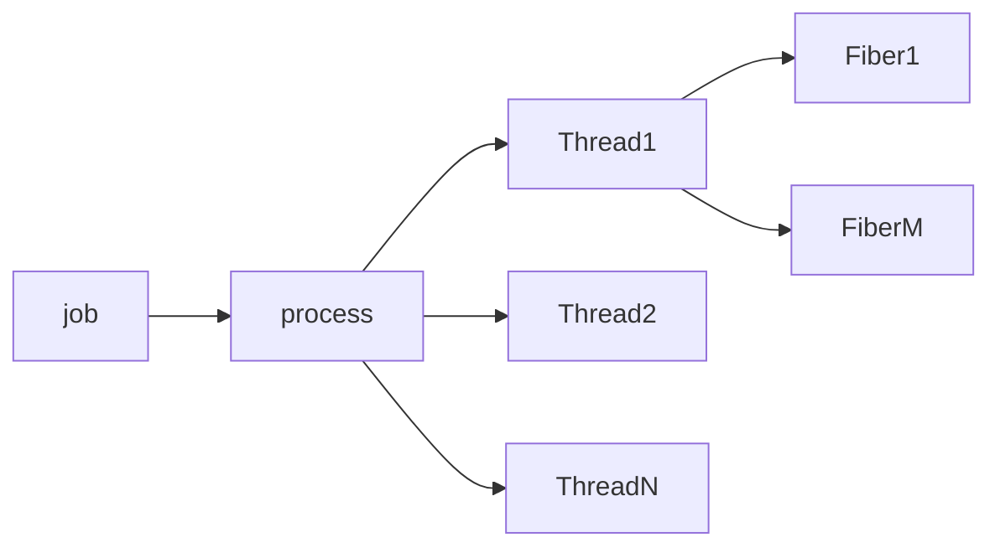
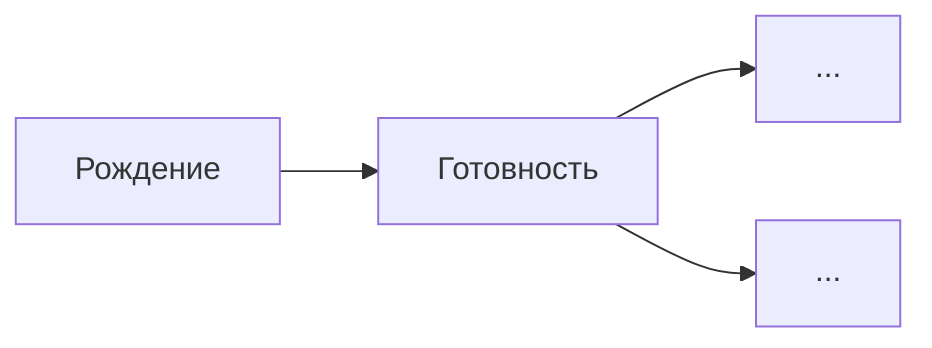
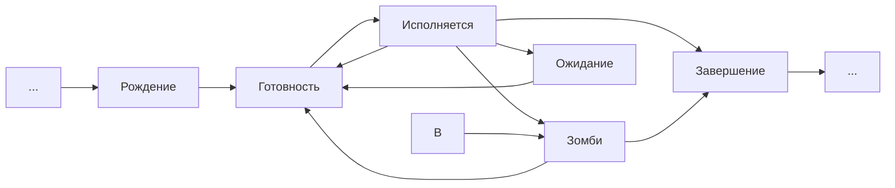

# Билет 1

Программные диспетчеры появились в конце 40-ых, начале 50-ых годов. Сначала код каждый раз загружался заново в память, программа выполнялась, код выгружался. 

ОС - базовое(изначальное) системное(само по себе не используется) ПО, управляющее работой вычислительного узла и реализующего универсальный интерфейс между аппаратным, программным обеспечениями и пользователем.
(борьба за ресурсы, многопользовательский режим)

OS

   <-> software
  
   <-> user

   <-> hardware
      
Концепции программ диспетчеров:

1) Повторное использование кода
    
    Позже появились идеи выделить некоторую часть RAM, чтобы загрузить туда часть часто используемых инструкций (микропрограмм). Появилась простейшая линковка. Дальше оказалось, что не очень удобно, когда это хранится в статических адресах, но на тот момент всё размещалось статически.
2) Оптимизация взимодействия с утройствами ввода-вывода - механизм(контроллер, обработчик прерываний, прерывание(прерывание реализовано было в архитектуре процессора)
    
    Когда выяснилось, что RAM всегда не хватает, решили использовать spooling, чтобы загружать данные в RAM параллельно. Появился контроллер, контролирующий управление данными. 
    
    Прерывание - сигнал, поступающий от внешнего устройства в ЦП, сообщающий о наступлении некоего события, преостанавливающий выполнение текущего потока команд, и передающий управление подпрограмме обработчику прерываний.
    
    
3) Однопрограммная пакетная обработка

   Программы усложняются =>    программы должны писать многие, множество констант, множество модулей -> создание пакетов (на внешнем ЗУ собрать совокупность модулей, параллельно обрабатывается один пакет и выгружать в RAM другой) -> появление очереди (необходимость принципов, понятие приоритезации(появление), появление линейных алгоритмов(в зависимости от загрузки ЦПУ например)
  
   появилось понятие "пакет" -- совокупность программных компонентов и, возможно, данных, связанных с ними. При этом становится логичным, чтобы storage хранила последовательность пакетов, которые потом будут выполнены. Появляется очередь. Поэтому начинают появляться первые планировщики. )

[Фоточка-картиночка архитектуры на втором этапе](https://lh3.googleusercontent.com/OhKCqwiDnW6cbS2WBOYTnQJfq3RGMOIAD1mek4Y5zgw-3RkT8f-6HOhMvXeoIIzUOoAKC2krJWP-)


# Билет 2

Этап многозадачных(мультипрограммных) операционных систем.

Попытка оптимизации ресурсов(программа может много читать, но мало делать операций с вычислениями, или, наоборот, мало операций ввода вывода)
Предсказывать не можем, анализ слишком не эффективен.

Процесс выполнения начинает разбиваться на две явные фазы: обработка данных и операции ввода-вывода. 

Механизм разделения процессорного времени. Есть несколько процессов, даем возможность выполнять фрагменты по очереди.

1) Механизм переключения:
 
    1) через равные промежутки времени переключаем
    2) переключение, когда поток закончился.
 
    Так как должны сохранить состояние, то надо сохранить регистровый контекст, передать управление( и загрузить регистровый контекст другого процесса). 
Но выигрыш именно за счет того что есть операции ввода-вывода(балансировка за счет наличия двух устройств ЦПУ и контроллера)
    
    Создаем аппаратное устройство таймер, прерывание таймером (+ к прерыванию ввода вывода) обработчик прерываний меняет контекст.
Появляется концепция разделения времени. Сложнее оказалось разделить память. (писали именно код с прямыми адресами, от нуля считали адреса, если несколько программ, то не можем предсказать, от какой константы считать адрес, адресное пространство было непрерывным) После появления этой проблемы появилась концепция виртуальной памяти - абстракция, которая позволяет при написании программы использовать адресацию от 0, а при испольнии подменять адреса на адреса физического расположения.

2) Модель чувствительна к ошибкам, если все данные находятся в одном месте. Сейчас мы получаем исключение(если например обращаемся к данным, которые нам не принадлежат). 
    
    Появляется механизм защиты памяти(позволил программно-аппаратно реализовать проверку обращние к адресам, которые принадлежат нашему пространству) и появления привилегированного режима. 
3) Концепция виртуальной машины для программ.
     Механизм планировщиков, использующий многофакторное планирование 
    
    Простые механизмы планирования не работают(не даем времени на выполнения операций, но выгружаем в память данные, которые не будем обрабатывать) -> целевая функция не линельна, задачи планирования вынесли в отдельный механизм

4) Механизм первых файловых систем, контролируемый доступ ко внешник ЗУ.

    Ошибка вычисления может провоцировать ошибку при чтении данных. 
    
    Появляются механизм прав доступа к файлам.
    
Итого: мы изолируем процесс от работы машины. Каждый процесс выполняется внутри вируальной машины, полностью изолирован

От термина прерывание отказали - теперь есть системый вызов - обращение к прикладной программы к ОС с требованием предоставить дополнительный ресурс или выполнить привелегированную операцию

В 1963 году появляется MCP(main command program). Её в описании назвали уже "операционной системой". Она поддерживала всё, описанное выше, мультипроцессорную обработку. На этом завершается второй этап.

# Билет 3

**Сетевые операционные системы.**

Программы становятся все более доступными(больше кодеров), но компьютеров очень мало и позволить их себе могут не многие(дорогие, обслуживание сложно).
Стоимость владение очень высока, а время использование мало. Появляются компании, которые начинают продавать машинное время.
Таких компаний много, но тех, кому надо вычислить данные, еще больше. Приходилось высылать людей в другие города.
В те году AT&T соединил огромное количество городов США сетью. С помощью телефонной связи передавали цифровой сигнал (до 1000 байт/сек скорость).

Появляется понятие "Терминал" - совокупность устройств ввода и вывода.
Вместо одной точки входа появляется несколько, и устройство позволяющее переключаться между ними.
Соедиение по телефонной линии позволяло подключать например клавиатуру, и выводить данные у себя на месте.

Точек входа бесконечно много => проблемы с безопастностью. Кому какой доступ и к чему предоставлять?
появление концепции учетной записи. Авторизация с привязской с счету, возможность наблюдения за своим счетом.

Не оптимизированное распределение пользователей по серверам(простой), невозможность заставить пользователей связываться со свободным сервером(данные учетной записи сложно передавать) подталкивает к идеи создания распределенных ОС.
Имеем каналы связи с другими узлами, испльзуем другие узлы для выполнения заданий.

Идентификация(присвоение идентификатора) -> аутентификация(сверка с данными системы) -> авторизация(предоставление прав). 

Данная концепция появляется, чтобы разграничить права доступа. 
Однако возникает проблема простоя некоторых узлов. Появляется понятие компьютерной сети. В конце 60-ых завершается третий этап. 

**Этам мобильных операционных систем**

Разработка каждой операционной системы для каждой новой модели компьютера требовала многих лет напряженной высококвалифицированной работы. При этом каждая ОС первоначально разрабатывалась на низкоуровневом языке – языке ассемблера. Поэтому еще в 1960-х гг. возникла идея разработки мобильных (переносимых) ОС – операционных систем, которые могли бы использоваться на нескольких семействах компьютеров путем переноса их кода (возможно, с небольшими изменениями) с более старых моделей на более новые. Заметим, что термин мобильный используется здесь в ином понимании, отличном от того, к которому мы привыкли ныне (мобильные телефоны и операционные системы для них).

Появление "мобильных ОС". До этого момента операционная система создавалась **уникально** для каждого компьютера. Компьютеры имели разные архитектуры, разная адресация памяти, команды процессора. Программисту приходилось заново осваивать системные вызовы, не было переносимости кода. На этом этапе появилось абстрагирование ПО от конкретных компьютеров. 

Появление UNICS. В 1967 году запускается проект -- multics (?). Кенн Томпсон решает, что неплохо было бы перенести принципы этой ОС на все компьютеры. Для этого нужен был язык высокого уровня. 
С
начала пишут первую версию к первому января 1970 года целиком на ассемблере. 
Создаётся язык B, язык высокого уровня. На нем создаётся компилятор и начинает переписываться ядро ОС. Это происходит где-то к 1972 году, second edition. 
Разрабатывается язык С. Для него сначала пишут компилятор, затем прямо на С пишут ядро ОС. В 1975 году появляется полностью на C edition five и имеющая встроенный компилятор С. UNICS становится UNIX
В последней седьмой версии появляется предшественник Bash'a.

Первая мобильная ОС была разработана в 1970 г. Брайаном Керниганом (B. Kernighan) и Деннисом Ритчи (D. Ritchie) в фирме AT & T и получила название UNIX. Даже в самом ее названии заложено своего рода противопоставление MULTICS (multi - много, uni – один) – последняя известна своей усложненностью. Этим названием авторы подчеркивали основную идею UNIX – унификацию и упрощение представления файлов и операций над ними (в UNIX файл – это последовательность байтов), пользовательских программ и процессов. Унифицированным, не зависимым от целевой аппаратной платформы, был также исходный код UNIX, который был полностью написан на специально разработанном новом языке Си (основными авторами Си, как и UNIX, являются Б. Керниган и Д. Ритчи). Использование языка высокого уровня для разработки UNIX было революционным шагом в истории ОС и позволило, во-первых, значительно ускорить и облегчить разработку, во-вторых – перенести UNIX на многие модели компьютеров (для которых при этом, разумеется, необходимо было разработать компилятор с языка Си). Впервые система UNIX была использована в 1970 г. на миникомпьютере PDP-10. Компьютеры фирмы PDP образца начала 1970-х гг. принято относить к классу миникомпьютеров. Хотя данное название с современной точки зрения не вполне правомерно: такой компьютер занимал два небольших шкафа, по сравнению с mainframe-компьютером образца 1960-х гг., занимавшим целый зал. Объем оперативной памяти миникомпьютеров составлял всего порядка 32 килобайт (!). Однако на них успешно работала ОС UNIX (были и другие ОС – например, RSX-11), был компилятор с языка Паскаль, была реализована удобная система файлов и программа для работы с ними, были доступны математические библиотеки программ.

Из-за законодательства США появляется ситуация, когда AT&T не могут защитить патентами код UNIX. Пользуясь теми моментами, когда код ещё не был защищён, университеты США (в частности, Беркли) забирает себе исходный код UNIX и начинает развивать собственную ветку. Создаётся собственная дочерняя компания BSD. Противник Беркли, Стэнфорд, создаёт SUN, которое создаёт SUN OS, на котором работает ЦДО ИТМО. В это время AT&T удаётся закрыть код UNIX патентами. 

В восьмидесятые годы наступает расцвет ОС. Появление проекта Darwin, из которого позже разовьётся mac OS. 
Появляется идея, связанная со свободой. Все начинают понимать, что развитие ОС тормозится патентами. Ричард Столлман, преподаватель MIT, начинает продвигать идею создания ОС, которую невозможно было бы закрыть патентами. Мы делаем код, публикуем его под такой лицензией, чтобы если ты взял наш код и хотя бы как-то дополнил его, ты обязан выпустить свой продукт под этой же лицензией. 
Разработчики, включая Столлмана, переписывают компилятор С полностью с нуля, чтобы создать полностью свободный компилятор. Надо решить непростую задачу -- написать ядро. Танненбаум стартует свой проект minix, выступает с докладом про него. Во время доклада возникает спор между молодым аспирантом из аудитории и Танненбаумом. Этим аспирантом был ~~Эйнштейн~~ Линус Торвальдс. 
Создаётся GNU is not unix. Появление GNU/Linux.


ПЕРСОНАЛЬНЫЕ ОС

В начале 1980-х годов появились персональные компьютеры. Операционные системы для них фактически повторили в своем развитии операционные системы для компьютеров общего назначения: в них были использованы аналогичные идеи и методы. Однако первые персональные компьютеры были менее мощными, чем mainframes, как по объему памяти, так и по быстродействию и разрядности микропроцессора. Первый распространенный микропроцессор фирмы Intel был 8-разрядным, и для него была разработана также 8-разрядная операционная система CP/M. В 1975 г. была создана фирма Microsoft, и ее первой разработкой была 16-разрядная операционная система MS DOS для персональных компьютеров с процессорами Intel 8086 (или, коротко, x86). В командном языке MS-DOS чувствуется явное влияние UNIX, однако MS-DOS предоставляет гораздо меньшие возможности командного языка.

В начале 1980-х гг. фирма Apple выпустила персональные компьютеры Lisa и Macintosh с операционной системой MacOS. Ее характерной чертой была реализация удобного графического пользовательского интерфейса (GUI) в виде окон, меню, "иконок" и многих других элементов GUI, к которым мы с Вами ныне так привыкли. MacOS стала первой ОС с развитой поддержкой GUI (для сравнения, MS-DOS предоставляла возможности работы непосредственно на командном языке).

В конце 1980-х - начале 1990-х гг., под влиянием MacOS, Microsoft разработала графическую оболочку Windows над операционной системой MS-DOS. Первая версия Windows, таким образом, еще не была операционной системой; она запускалась командой win из командного языка MS-DOS. Однако многие современные черты GUI, характерного для Windows, ставшие "родными" для пользователей Windows, в ней уже присутствовали. Затем были выпущены Windows 3.x и Windows for Workgroups (уже операционные системы), в 1995 г. – Windows 95 (с развитыми мультимедийными возможностями, большим набором встроенных драйверов для различных устройств и поддержкой механизма Plug-and-Play подключения нового устройства без остановки компьютера) и Windows NT с развитыми сетевыми возможностями и повышенной надежностью. Именно Windows NT стала основой для последующего развития Windows. В настоящее время наиболее популярными моделями Windows являются Windows XP (поддержка которой фирмой Microsoft уже завершается – система выпущена в 2001 г.), Windows 2003 Server, Windows Vista,Windows 2008 Server и Windows 7.

В начале 1990-х гг. появилась первая версия ОС Linux (ОС типа UNIX с открытыми исходными кодами ядра), которая постепенно приобрела значительную популярность, но, главным образом, используется на серверах. Большинство клиентов (пользователей) в мире предпочитают на своих компьютерах Windows или MacOS (заметим, что, например, в США и Канаде компьютеры Macintosh более популярны, чем Windows-машины с процессорами Intel или их аналогами).
 


Цели архитектуры: 

1) Обеспечение производительности, надежности, безопасности пользовательского обеспеченения (противоречивые цели, хотим надежность - удар по производительности(журналирование, перезапись). безопасность - шифрование хорошо, но производительнсоть страдает)

2) Обеспечение производительности, надежности, безопасности использования аппаратного обеспеченения. Только ОС имеет доступ ко всему аппаратному обеспечению

3) Обеспечение производительности, надежности, безопасности хранения данных

4) Обсепечения доступа к телекоммуникационным ресурсам. Сейчас все ПО гибридное (часть кода выполняется в облаке или в удаленных вычислительных узлах), часть ПО используется для осуществленния коммуникации. Канал внешний - один => ПО конкурирует за ресурс. Несколько каналов (Bth, Wi-fi)

5) Организация работы с пользователем (возможность управления пользователя всем)

# Билет 4

https://youtu.be/8ATDeN0mLHA?list=PLk-kd1TpYlH4L78FjF_ZCGCGrNHDsa_hV&t=1517

Функции ОС:

1) Организация интерфейся между приложениями и аппаратным обеспечениям:

    _Организация (обеспечение) удобного интерфейса между приложениями и пользователями, с одной стороны, и аппаратурой компьютера – с другой. Вместо реальной аппаратуры компьютера ОС представляет пользователю расширенную виртуальную машину, с которой удобнее работать и которую легче программировать. Вот список основных сервисов, предоставляемых типичными операционными системами._
        
    1) механизм API
    2) поддержка исполнения программы (нажали на ярлык -> ОС решила, стоит ли открывать, ресурсы для приложения предоставлены, приоритет определен, загрузка кода в память)
    
        _Для запуска программы нужно выполнить ряд действий: загрузить в основную память программу и данные, инициализировать устройства ввода-вывода и файлы, подготовить другие ресурсы. ОС выполняет всю эту рутинную работу вместо пользователя_
    
    3) обеспечения доступа устройств ввода-вывода (устройства будут меняьтся, есть универсальный интерфейс(буфер полон, опустошен))
       
        _Для управления каждым устройством используется свой набор команд. ОС предоставляет пользователю единообразный интерфейс, который скрывает все эти детали и обеспечивает программисту доступ к устройствам ввода-вывода с помощью простых команд чтения и записи. Если бы программист работал непосредственно с аппаратурой компьютера, то для организации, например, чтения блока данных с диска ему пришлось бы использовать более десятка команд с указанием множества параметров. После завершения обмена программист должен был бы предусмотреть еще более сложный анализ результата выполненной операции._
        
    4) контролирование доступа к файлам 
    
        _При работе с файлами управление со стороны ОС предполагает не только глубокий учет природы устройства ввода-вывода, но и знание структур данных, записанных в файлах. Многопользовательские ОС, кроме того, обеспечивают механизм защиты при обращении к файлам._
    
    5) обнаружение ошибок и их обработка (приложение не может найти строчку, где была ошибка. обработка ошибки -> работа ОС))
    
        _При работе компьютерной системы могут происходить разнообразные сбои за счет внутренних и внешних ошибок в аппаратном обеспечении, различного рода программных ошибок (переполнение, попытка обращения к ячейке памяти, доступ к которой запрещен и др.). В каждом случае ОС выполняет действия, минимизирующие влияние ошибки на работу приложения (от простого сообщения об ошибке до аварийной остановки программы)._
    
    6) учет использования ресурсов (потребность в быстродействии, отслеживание проблем, вызывающих медленное действие, анализ ресурсов)
       
        _Хорошая ОС имеет средства учета использования различных ресурсов и отображения параметров производительности вычислительной системы. Эта информация важна для настройки (оптимизации) вычислительной системы с целью повышения ее производительности._
   
_В результате реальная машина, способная выполнить только небольшой набор элементарных действий (машинных команд), с помощью операционной системы превращается в виртуальную машину, выполняющую широкий набор гораздо более мощных функций. Виртуальная машина тоже управляется командами, но уже командами более высокого уровня, например: удалить файл с определенным именем, запустить на выполнение прикладную программу, повысить приоритет задачи, вывести текст файла на печать и т.д. Таким образом, назначение ОС состоит в предоставлении пользователю (программисту) некоторой расширенной виртуальной машины, которую легче программировать и с которой легче работать, чем непосредственно с аппаратурой, составляющей реальный компьютер, систему или сеть._

# Билет 5

2) Организация эффективного использования ресурсов
   
    Есть приложения, которые конкурируют за ресурсы.
     
     Механизмы:
     
    1) Решение задачи многокритериального выбора
        
       Хотим использовть все ресурсы эффективно, но есть много критериев (пропустим в очереди быстрые процесс, освободим память когда он выполнится, тяжелый процесс будет быстрее выполняться)
       
       K = a*K1 + b*K2 + c*K3 ...
       
       Но не всегда эффективно(как например при посадке самолета начнем обновлять ПО)
       
       Тогда K = max(a*K1 + b*K2) при условии (K3 < Z)
       
       Плохо тратить много времени на поиск оптимального решения
       
    У меня есть некоторое количество мощностей и критериев K, которым я хочу удовлетворять. Введём __суперкритерий__ K с крышечкой, который будет некоторой свёрткой всех критериев с некоторыми коэффициентами. 

    Для систем реального времени используют __условный критерий__: я пытаюсь найти максимум от некоторой свёрткой, при условии, что некоторый конкретный критерий находится в некоторых границах. 

    Для того, чтобы найти эти коэффициенты при критериях, используют цикл __PDCA__ (Plan--Do--Check--Act).
       
    2) Функционал, связанный с адаптивным управлением
        
        ОС - открытая система, запуск приложений асинхронен, все постоянно меняется. Запрос ресурсов, информация из сети - все случайно.
        
        Значение коэффициентов - стационарное. Разговор про горизонт планирования (большой - чем дальше отдаляемся от начала, тем не эффективнее, так как все меняется, но если горизонт малый, то пересчет неэффективен.) Поиск способа адаптации.
        
    3) Обеспечение надеждной эксплуатации аппаратно-программных средств
        
        1) механизмы диагонстики работы ОС (неработающие приложения в фоновом режиме)
        
        2) Срество восстановления последней работоспособной конфигурации (обновление ядра, возможность возврата)
        
        3) Средство восстановление поврежденных файлов и данных
        
        4) Обеспечение возможности развития ОС (долгая разработка и перспектива использования, механизм обновления драйверов, ограничение параметров (например в файловой системе))
            1) механизм обновления драйверов и модулей работы с ПО(ограничение параметров (например в файловой системе))
            
            2) механизм обновления, связанные с серверами ОС 
            
            3) механизм исправления в коде (ядра) в случае уязвимостей или ошибок(не сервис, не отдельный модуль или функциональность)
            
ОС проектируются десятилетиями и на десятилетия, поэтому практически отсутствует возможность прогнозирования, в каких условиях она будет работать. 

# Билет 6

### Архитектура операционной системой


Принципы:
1. Модульная организация (удобство многоуровнего модульного тестирования, интеграция, разработка совместная)   
2. Функциональная избыточность (закладывая архитектуру, должны обеспечить больше функционала, чем нужно. Ипользуем ОС на долгое время. ОС ставится на вычислительные узлы с разным назначением. Предпринимальись попытки специализированных ОС. Редкость. Windows 2000 Server. Стоимость разработки высокая, создаем универсальную ОС, отключаем функционал)
3. Функциональная избирательность (отключаем ненужный функционал, можем поставить на ноут, где нет USB, но служба будет работать(или для принтера сервис). А так же возможность поменять драйвера, отключить сервисы для более низкого потребления ресурсов)
4. Принцип параметрической универсальности (не надо хардкодить, выносим константы в упаралвяемые внешние настройки (ext3, нельзя записать в таблицу размер файла больше 2 Тб, хотя файл в цепочке можно было записать на диск любого размера))
5. Разделение на модули, исполняемые в режиме ядра и пользовательском режиме. Задача ОС - абстрагировать ПО от аппаратного обеспечения. Привелегированный режим - код может получить доступ к любому адресу RAM. Код ядра ОС выполняется в привелигированном режиме. Реализация:
    1) защита отключается, если мы в привелигированном
    2) код в привелигированном режиме может сам отключать/включать защиту
    
     Код ядра выполняется в привелигированном режиме

    Код ядра резидентен(всегда в RAM, и после загрузки не меняет адресов). Почему? 

    * Защита, никто не может в этот код вторгнуться. Если бы мы сделали возможность сбрасывать код ядра в подкачку, то могли бы отсоединить устройство, поменять код и вернуть обратно.

    * Обеспечение быстродейтвия. Когда приложение работает, то запрашивает ресурсы, в рамках процесса происходят системные вызовы, т е происходит исполнение кода ядра. Код ядра неизменный в адресном пространстве и мы не должны пересчитывать адреса.


Выделение хотя бы двух пространств: __user space__ и __kernel space__

**Привилегия** -- возможность доступа к физическим адресам памяти, а не приоритет в каких-либо операциях. Только ядро в привилегированном режиме имеет доступ к физическим устройствам и памяти. 
Кроме того, что ядро должно быть привилегированно, оно ещё должно быть __резидентно__, т.е. полностью и всегда расположено в оперативной памяти. 

# Билет 7 (смотреть все далее)

# Билет 8

Дальше возник спор: а что тогда должно быть в ядре? 
N.B. Ядро linux на момент написания данного конспекта включает приблизительно 8млн строк кода. 

Самый первый вид, о котором мы говорим -- __монолитное ядро__. Весь функционал реализован в ядре, ядро имеет целостное адрестное пространство, все процедуры видят друг друга. Плюс: быстрота. Минус: писать такое ядро и отлаживать сложно, огромное количесство функций, ядро надо перекомпелировать после установке драйверов(перекомпиляция может занять несколько дней).  Ядро особо не структурировано в плане доступа. Любая процедура может вызвать и передать данные любой другой процедуре. Тем не менее, даже в монолитной структуре выделяют три слоя, которые абстрагированы друг от друга:
1. Main program ("software") Главная программа
2. Service procedures 
3. Utilities ("драйверы")


ПО осуществоляло Системный вызов в ядро, главная программа - единая точка входа, Главная программа осуществляла валидацию вызова, осуществлялся вызов сервиса - фрагменты кода, отвечающие за выполнение операций. Утилиты - драйвера, которые отвечают за компонент аппаратного обеспечения, один сервис вызывает совокупность протоколов(утилит)

__Системный вызов__ -- это обращение пользовательской программы к ядру ОС с требованием предоставить дополнительные ресурсы или выполнить привилегированную операцию.
Как это устроено: у каждого приложения, которое запускается, выделяется некоторая область памяти, в которой находятся некоторые параметры. 
Дальше, если необходим системный вызов, программа заполняет это пространство и делает программное прерывание. Система это замечает, смотрит на номер процесса, который вызывает, находит по таблице его адресное пространство, смотрит на номер системного вызова, делает валидацию параметров, после чего main program определяет, какой сервис будет отвечать за выполнение системного вызова. 
После выполнения приходит код возврата об успешном или нет выполнении вызова, формировались выходные параметры, управление передавалась в точку вызова, код приложения считывал результаты выполнение, приложение выполнялось дальше.
Утилиты, по большому счёту, это драйверы. Утилиты -- это то, что взаимодействует непосредственно с железом. 

Какие минусы быстро возникли:
* если я хочу что-то поменять в работе ОС, то, как минимум, это перезапуск ядра, как максимум -- перекомпиляция ядра
* требует много памяти
* если меняем утилиту или сервис, то должны представить, кто вызывает нас, нужно представить полный граф, занимает много времени, появилась потребность между слоями использовать абстрактный интерфейс


Плюсы:
* никаких накладных расходов -> быстродействие 
* максимальная надёжность

~

_Монолитное ядро - с точки зрения программного кода все компоненты программного кода видят друг друга (полная прозрачность всех процедур и подпрограмм). Три слоя монолитного ядра: верхний слой содержит главную программу (точка входа), средний - системные вызовы, третий слой - утилиты для работы с аппаратным обеспечением. Программное обеспечение перед тем как выполнять системный вызов помещает системный данные в качестве параметров в памяти (код данных и операций) > главная программа считывает, что требуется ПО > выбирается сервисная процедура (сколько нужно выполнить столько и будет сервизных процедур) > сервизная процедура может вызвать несколько соответствующих утилит > утилиты взаимодействует с аппаратурой > главная программа возвращает ПО ответ либо можно делать / либо сообщение об ошибке. Преимущества: надежность (никакое ПО не может вмешаться в работу ядра ОС), минимальные накладные расходы (все прозрачно, без дополнительных интерфейсов). Недостатки: очень плохая изменяемость - изменение одной функции ведет к изменению всей ОС, исходный код ядра менялся под новые версии драйверов и тд, перекомпиляция ядра). Применяются во  встраиваемых программах._

~

# Билет 9

### Многослойное ядро
Его иногда считают подмножеством монолитных ядер. Действительно, оно остаётся монолитным, просто количество слоёв увеличивается и появляется некоторое количество абстракций, которое позволяет переписывать отдельные уровни без влияния на остальные. 


Уровень аппаратной поддержки ядра(реализован в чипсете):
* работа с прерываниями(пониманием, что именно это устройство сгенерировало именно это прерывание)
* работа с контекстом процессора(переключение с сохранением контекста)
* средство поддержки привелегированного режима
* средство поддержки памяти
* системный таймер(переключение между процессами)

Следующий уровень: **Hardware Abstraction Layer (HAL)** - дравера, часть кода, зависящая от железа.

Первые 2 уровня определяют возможность запуска ОС на аппаратной платформе.

Вы должны сделать абстрагирования всякого кода, связанного с принятием решений и тд, от платформы. Взаимодействие двух этих уровней позволяет работать системам на разных платформах. То, то раньше было утилитами, во многом переехало на HAL уровень. 

За HAL'ом идёт следующий уровень, который обычно называют **базовые механизмы ядра**. Будем рассматривать его в совокупности со слоем **менеджеров ресурсов**. 

Безовые мезанизмы - те, кто делает(исполнительский код, поменять страницу №Х на №У. Вызвать модули, передать параметры, сформировать код возврата). Менеджеры ресурсов - думают(какую страницу на какую поменять).

Мы решили, что мы выделяем данному процессору некоторое адресное пространство. Теперь нужно его выделить. Эти процессы лучше разбить на разные уровни, потому что мы хотим, чтобы мы могли менять менеджер ресурсов (алгоритмы, подходы и тд), а исполнительский уровень не хотелось бы трогать. 

Последний слой: **слой системных вызовов** 

Обеспечивает абстракцию от программного обеспечения. Запуск приложений, которые писались под другие ОС.
Это тот слой, который нам обеспечивает взаимодействие находящегося снаружи программного обеспечения с нашим ядром. Сейчас этот слой предоставляет не одну точку входа (main program), а среды окружения. 

Где мы победили:
* можем переписывать отдельные слои

Появилась модульность ядра, создается очередь к модулю, меняем модуль, когда готов, выполняет все из очереди. Приемр испльзования: вставили флешку, без перезагрузки ядра драйвера установились, или расширили пространство жеского диска.

Где мы **не** победили:
* по-прежнему съедаем большое количество памяти изза резидентности
* попытка построить распределенные системы(осуществлять управление ресурсами на разных узлах). Менеджер привязан к каждому узлу. Общий менеджер - слишком сложно и медленно.
* без перезапуска всё ещё сложно заменить что-то в ядре(даже в одном слое)

~

_Многослойная монолитная архитектура. Схема данной архитектуры в центре находится железо. Первый слой - аппаратные средства поддержки ядра (микропрограммы записанные в чипсете материнской платы, например, для перехода в привилегированном режим ОС, защита памяти, системный таймер, механизм прерываний, смена контекста ( )). Именно из-за первого слоя не на все железо можно поставить определенные ОС (если на первом слое это не реализовано, то невозможно). Второй слой (первый программным слой) - машинно-зависимые модули (слой абстракции железа HAL) - фактически драйвера для железа (чтобы ОС не зависима от конкретной аппаратной платформы). 3 слой - базовые механизмы ядра - на нем реализуется все основные функции ОС (открытие/закрытие файлов, подкачка и тд). Однако данный уровень является только исполнительным, принятие решений здесь не происходит. 4. Менеджеры ресурсов (слой принятия решения) - реализованы все алгоритмы принятия решений (какой процесс будет выполняться следующим, какие файлы открыть). Последний слой - системные вызовы (интерфейс API) - слой отвечает за взаимодействие ПО и ОС (ПО знает о существовании только этого слоя). В таком режиме все слои резиденты в оперативной памяти. Преимущества: реорганизация ядра становится легче (изменение требуется только на одном слое), процессорная производительность довольно высока (на переключение между режимами ядра и приложения время минимально 2дельтаТ(туда-обратно)). Недостатки: большие накладные расходы по оперативной памяти, ПО не может выполняться на нескольких аппаратных средствах (ядра не взаимодействует друг с другом)._

~

# Билет 10

### Новые концепции
Выполнение части задач на других аппаратных узлах. В чём проблемы? Менеджер ресурсов один. Он привязан к железу и не может ничего делать с другими узлами. 
Как выйти из этой ситуации? Нужно уходить из ядра, однако это сломает безопасность. Кроме того, это вызовет накладные расходы. 
Таким образом появилась **микроядерная архитектура**.
##

У меня есть user mode и kernel mode. 

В kernel mode я оставлю:
* базовые механизмы
* HAL
* аппаратную поддержку

 В user mode разместим сервера. 
 
 [Схемка многоядерной архитектуры](https://lh3.googleusercontent.com/bjD2EEE3S5gjq--XqWFnS_MrAJ9cD_hy4UiP43rBgGrXAzw6jmEr7XQ-aryatQ6GnZN6F2n3p1km "Схема микроядерной архитектуры &#40;справа затесалась многослойная&#41;")

Как происходит обработка системного вызова? Приложение осуществляет вызов в ядро, механизм делает из ядра возврат в другой сервис, сервис обрабатывает, вызывает ядро, ядро опять в другой сервер(и так далее), многократный обмен между серверами, переключение из режимов пользватель-ядро занимает время

* Плюс: выигрыш в памяти
Проблема: мы часто не используем сервера, но они продолжают висеть в системе и жрать ресурсы. Что делать?
Не использую сервер печати? В файл подкачки его. Не использую сервер сети? В файл подкачки. Разница в 60-70 раз по ресурсам. 

* Плюс: возможность создания распределённых систем. 

* Плюс: надежность(критическая ошибка в коде сервера не сильно влияет на работу(можем только данные потерять))

* Плюс: возможность отладки(сложный код серверов отлаживается не в режиме отладки ядра)

Чем за это заплатили? 
* производительностью 
* сложно обеспечивать безопасность и надежность, сервера в пользовательском режиме конкурируют за ресурсы с пользовательскими программами. Но это решается например планировщиком(системные процессы всегда важнее).

~

_(4 и 5 слои вынесем в отдельные программы). В ядре будет содержатся два слоя: машинно-зависимые модули и базовые механизмы ядра. В пользовательское режимы будут находиться сервера (памяти, вычислений), ПО, и все они равноправно могут вызывать ядро. Идея заключается в том, что есть вещи, которые обязательно нужно выполнять в ядре (выделение памяти), а принятие решений будут существовать отдельно как пользовательское ПО (в Microsoft это называется службами). Отсюда сервера не находятся в оперативной памяти, и появляются там только по требованию. В такой ситуации накладные расходы 4дельтаТ. Недостатки: большие процессорные накладные расходы, резкое снижение надежности. Преимущество: удобство работы с несколькими аппаратными системами, занимаем мало оперативной памяти.
 Микроядерная архитектура предоставляет только элементарные функции управления процессами и минимальный набор абстракций для работы с оборудованием. Большая часть работы осуществляется с помощью специальных пользовательских процессов, называемых сервисами. В микроядерной операционной системе можно, не прерывая ее работы, загружать и выгружать новые драйверы, файловые системы и т. д. Микроядерными являются ядра ОС Minix и GNU Hurd и ядро систем семейства BSD. Классическим примером микроядерной системы является Symbian OS. Это пример распространенной и отработанной микроядерной (a начиная c версии Symbian OS v8.1, и наноядерной) операционной системы._
 
~


### Наноядро
Остается только HAL уровень. Базовые механизмы реализованы не в режиме ядра. На основе данных ядер строиятся гипервизоры и средства виртуализации. Если запускаем виртуальную ОС, то ее планировщик работает в слепую, т.к. не знает, сколько времени выделит планировщик хозяйской ОС.

Гипервизор умеет абстрагировать аппаратный уровень и отдавать доступ по простому закону(поровну например). Используется в серверах

По факту, в ядре остаётся только обработка прерываний. Всё остальное вынесено за пределы ядра, а ядро просто обрабатывает прерывание. 

Где и зачем это применяется: так работает виртуализация (домашняя). При серверной виртуализации используются другие подходы, потому что иначе слишком высокие накладные расходы. 

~

_в ядро входят только машинно-зависимые модули. Крайне упрощённое и минимальное ядро, выполняет лишь одну задачу – обработку аппаратных прерываний, генерируемых устройствами компьютера. После обработки посылает информацию о результатах обработки вышележащему программному обеспечению. НЯ используются для виртуализации аппаратного обеспечения реальных компьютеров или для реализации механизма гипервизора._

~

### Экзоядерная архитектура (инвертированная)

В ней мы в ядре оставляем планировщики и только их. Тогда мы теряем жёсткость контроля над оборудованием. Что мы приобретаем? Возможность работы при нестабильности железа. Любой сбой любого драйвера? Ничего страшного. Правда мы не гарантируем никакой консистентности и сохранности данных. 

~

_предоставляет лишь набор сервисов для взаимодействия между приложениями, а также необходимый минимум функций, связанных с защитой: выделение и высвобождение ресурсов, контроль прав доступа и т. д. ЭЯ не занимается предоставлением абстракций для физических ресурсов – эти функции выносятся в библиотеку пользовательского уровня (так называемую libOS). В отличие от микроядра ОС, базирующиеся на ЭЯ, обеспечивают большую эффективность за счет отсутствия необходимости в переключении между процессами при каждом обращении к оборудованию._

~
##
Все реальные ОС имеют **гибридные ядра**, поэтому большинство из них называют **гибридными**. 

~

_Гибридные ядра (модифицированные микроядра, позволяющие для ускорения работы запускать "несущественные" части в пространстве ядра. Имеют "гибридные" достоинства и недостатки. Примером смешанного подхода может служить возможность запуска операционной системы с монолитным ядром под управлением микроядра. Так устроены 4.4BSD и MkLinux, основанные на микроядре Mach. Микроядро обеспечивает управление виртуальной памятью и работу низкоуровневых драйверов. Все остальные функции, в том числе взаимодействие с прикладными программами, осуществляются монолитным ядром. Данный подход сформировался в результате попыток использовать преимущества микроядерной архитектуры, сохраняя по возможности хорошо отлаженный код монолитного ядра.)_

~
Гибридное ядро - запускаем модули в одином из режимов в зависимости от ситуации.
**windows** -- в чистом виде гибридная архитектура
**linux** -- монолитное ядро, но с оговорками (многопоточное ядро, отдельные программные компоненты, в том числе на HAL уровне, могут быть заменены без перезагрузки при помощи заглушек)
**Mac OS** -- микроядро


# Билет 11
## Четвёртая лекция
### Процесс
Попытаемся разобраться, что такое процесс и что такое поток. 

**Процесс** - совокупность наборов исполняющихся команд, ассоциированных с ними ресурсов и контекстом испольнения, находящихся под управлением ОС. 

Почему процесс - это не просто набор исполняющихся команд? Потому что мы можем например запустить 2 процесса Grep в конвеере с один набором команд.

Почему важен контекст? Любой процесс в момент системного вызова переключается в режим ядра, причем мы должны сохранить контекст процесса (регистровый контекст и стек вызовов) в адресном пространтве этого процесса.

Нельзя ставить чёткое соответствие между программами и процессами. Например, одна программа может создавать больше одного процесса. В то же время, один процесс может быть совокупностью нескольких программ. 

Что значит ".... и ассоциированных с ним ресурсов". Если я запущу один и тот же файл несколько раз, набор исполняемых команд будет тот же самый, но ведь это другой процесс. Значит, он будет отличаться ресурсами, хотя бы адресными пространствами и файловыми дескрипторами. В UNIX любой процесс на старте получит три дескриптора: `stdin`, `stdout`, `stderr` с номерами 0, 1 и 2 соответственно. Ещё ассоциируются обычно сетевые порты (сокеты) и тд. 

"... и текущего статуса исполнения". С точки зрения существования ОС каждый процесс характеризуется его состоянием. Даже на уровне интуиции понятно, что процесс может либо исполняться, либо находиться в ожидании какого-либо процесса, либо находится в зомби-состоянии и тд. Этот процесс характеризуется этим состоянием, которое характеризуется его контекстом (состоянием регистров в последний момент исполнения). 

Наконец, последняя часть определения. ОС имеет монополию над процессами, соответственно, только она имеет полную власть над ними. 

20 лет назад стало очевидно, что многие задачи с большими массивами данных прекрасно распараллеливаются. Возникает вопрос, как разделить этот массив эффективно в условиях, когда мы не знаем, какие ресурсы будут нам доступны. Хочется, чтобы процессы по одному выбирали просто какой-то следующий доступный блок данных, когда потребуется. Тогда мы действительно получим преимущество по скорости. 

Появляется противоречие с концепцией изоляции процессов друг от друга. Для того, чтобы это исправить, сделали вполне понятный ход: давайте разрешим внутри одного процесса существовать нескольким потокам исполняющихся команд. Поток имеет свой регистровый контекст и свой стек, но данные у потоков одни.

Тогда мы переходим от понятия "процесса" к понятию **потока**. Сегодня любая ОС работает следующим образом: немного изменилось определение процесса. Сегодня процесс -- это контейнер, в котором существует как минимум один поток исполнения, в котором существует уже поток исполнения команд. 
**Процесс** -- контейнер ресурсов для совокупности потоков. Теперь любая ОС осуществляет планирование на уровне последних. 

Планировщик заданий дает выполнятся тому потоку, который по ожиданиям быстрее завершится. Не учитывается логика приложения, возможен рассинхрон потоков, когда один еще не успел вычислить значение переменной, которую исльзует другой поток. Нужно ставить блокировку, т.к. мы не управляем смоной потоков, а это замедление.

В линукс придумали идею облегченных потоков. Fiber - поток команд, который существует в едином (в отличие от потока) контексте, ОС о них не знает. Мы сами организовываем паралельную команду внутри одного одного потока(с точки зрения ОС). 

(-) У ОС есть таймер переключения потоков, как перераспределять управление между нитями? Втраиваем функции переключения между нитями в коде.

Допустим работаем в Ворде, и открыт браузер. В браузере 100 вкладок. Тогда приоритет Ворда 1 к 100. Надо уметь группировать процессы в группы. В Linux CGroup(common group), Windows - JOB. Контейнер процессов для группировки процессов и настроивать ресурсы для группы.



Система имеет монополию управления потоков. В ответ на запрос пользователей создаются отдельные волокна (fiber), которые позволяют управлять планировкой времени на уровне волокон. Линукс отказался от этой идеи с самого начала, MS же поддерживает. 
Дальше началась развиваться концепция, которая была хорошо забытым старым, потому что даже трёх уровней стало не хватать. Появился **job** (group). 
Например, есть chrome. У него много тяжелых вкладок, на которых много тяжёлого кода. Хотелось бы, чтобы вкладки выполнялись в разных процессах, чтобы краш одной вкладки не приводил к крашу браузера. Так же, если бы браузер использовал только один процесс, можно было бы спереть данные из одной вкладки через другую. Если у меня открыто 100 вкладок хрома и одна вкладка ворда, ворд получит 1/101 процессорного времени. Несправедливо. Так появился механизм **квантирования**. Грубо говоря, "Вот тебе определённое количество времени, больше не дам, сколько бы процессов ни было". 
Такова общая модель. 

### 

# Билет 12

Выделим, какие функции выполняет ОС для управления процессами. 
1. Создание процесса. 

    Процесс -- структура данных ядра, т.е. создать процесс значит создать структуру данных. Есть принципиальное различие между созданием процессов в линуксе и винде. 

    В линуксе они рождаются деревом планирования. Первый процесс `init` стартует ядро(ppid 0).
    Ядро запускает первый процесс `init`(а так же процесс, отвечающий за планирование многопоточного исполнения команд ядра), все остальные процессы порождаются процессом `init`. Любой процесс хранит свой `pid` и `parent pid`. Зачем это нужно? Во-первых, в такой модели удобно обеспечить анализ всех дочерних процессов. Любой процесс, завершаясь, посылает родителю информацию о том, что он завершается, дальше этот сигнал можно как-то обработать. 

    Никто из детей не получит больше прав чем родитель(только меньше). При порождении дочернего процесса в нем просто изменяются команды или данные(которые изначально были такими, как у родителя).

    Естественный минус -- что произойдёт, если у меня работает дочерний процесс и у меня крашнулся родительский? Теперь дочерний процесс стал осиротевшим (да, это официальный термин). Были попытки починить это усыновлением (и это, как ни странно, тоже). Это требует большого количество ресурсов для обработки целых двух уровней процессов, а не одного. Поэтому сейчас работает другая модель: если у нас теряется связь с родителем, то всех таких потомком усыновляет `init`. Почему это так? Просто потому что `init` имеет обработчик всех сигналов, которых конечное число (кажется, 64, только два из них пользовательские). 

    Зомби-процессом называется процесс, который завершился, родитель которого тоже завершился, но до него. Он не может получить информацию о том, что родительский процесс крашнулся. Он не может отослать родителю код возврата. Процесс уже не может жить и не может умереть. Чем они плохи? Они занимают дескриптор. Если аптайм каких-нибудь семь лет, зомби-процессы могут сожрать все pid'ы. Но зомби процессы не едят память, цпу.

    В windows всё устроено по другому. Он использует "государственную модель". Есть диспетчер процессов, который управляет абсолютно всеми процессами. Минус - диспетчер процессов узкое место(большая нагрузка). Диспетчер создает чистую структуру, поэтому дочерний процесс может обладать болшими правами чем родительский. Нельзя гарантировать, что при завершении родительского процесса завершаться все дочерние, т.к. за это отвечает диспетчер процессов и нужно помнить пиды всех дочерних процессов. Какое решение? Создание JOB для всех дочерних процессов. главным будет родитель, при завершении всех убиваем. Когда процесс хочет создать дочерний, он делает системный вызов. Ядро вызывает сервис диспетчера процессов, он создаёт новый процесс и родителю сообщает просто идентификатор дочернего процесса родительскому. В линуксе создание процесса это два системных вызова: `fork()` и `exec()`.  Что это нам позволяет? На базовом уровне обеспечить серьёзную безопасность, потому что дочерний процесс не может получить больше данных, чем было у родителя. 
    В винде дочерний процесс запрашивает те данные, которые ему нужны, и диспетчер процессов легко их ему выдаёт. Зато не бывает зомби-процессов.

2. Обеспечиваем процессы и потоки необходимыми ресурсами

    Механизм работает через системные вызовы.
    Бывает первичное обеспечение процесса и последующее. 
    Здесь тоже есть принципиальная разница: винда гарантирует каждому процессу чистое и независимое адресное пространство. Линукс клонирует родительское. Раньше это клонирование приводило к достаточно медленному созданию процесса. 

3. Изоляция процесса

    Запустили 2 процесса, которые печатают в принтер. При переключении процессов сигналы перемешиваются, значит надо блокировать один процесс.
    Она происходит на нескольких уровнях. 
    Во-первых, на уровне аппаратной поддержки ядра. Там реализована защита памяти: при каждом обращение к памяти происходит оценка, в чьё адресное пространство происходит обращение и срабатывает прерывание, если лезете не в свою память. 
    В линуксе создана достаточно простая модель: существует каталог ```/var/lock```. Там находится символическая запись файла. Процесс создаётся, смотрит, есть ли файл в этом каталоге. Если есть -- обращение не позволено. 

4. Диспетчеризация потока

    Смена потока на какой-нибудь другой. Она происходит в три этапа: сохранить регистровый контекст уходящего потока, загрузить новый регистровый контекст, сменить статус потока.
    Процедура смены статуса должна быть атомарной. Здесь происходит коллизия с прерыванием. Поэтому большинство ОС использует переход в однопрограммный режим. Поэтому большинство процессоров поддерживают очень опасный режим игнорирования прерываний. Чем это плохо? Тем, что если я плохо написал код между этими двумя процессами, то я уже ничего не сделаю, потому что процессор игнорирует прерывание. 

5. Организация межпроцессного взаимодействия

    Мы хотим, чтобы процессы были изолированны, но при этом могли обмениваться данными. Для этого нужен посредник. ОС гарантирует только одно: другой процесс получит сигнал, который перебросит ОС, а дальше он уже решает, обрабатывать его или нет. 
    
    Два варианта взаимодействия - через файл. Долго.
    Обмен сигналами.
    На примере линукса, существуют именованные каналы. Когда вы запускаете command1 | command2. Между ними существует буффер, чтобы обеспечить взаимодействие. На самом деле, этот буффер находит в пространстве процесса, который породил запуск этих подпроцессов. Что делать, если я нахожусь в изолированном процессе? Будет создан именованный канал. Будет создан "файл", в который одна программа пишет, а другая читает. Они оба залочены на чтение/запись. Но если бы файл был физическим. это было бы очень долго. Можем окрыть именованный канал по сети, тогда будет межсетеваое взаимодейтвие на узлах.
    
6. Синхронизация процессов и потоков

//todo 
    У меня есть два процесса, которые оба хотят использовать ресурс, который нельзя разделить. Как фиксить? ~вилкой~ Потребовалось десять лет, чтобы разработать теорию этого переключения. Дейкстра был одним из тех, кто смог решить эту проблему, но на тот момент его идея семафоров была нереализуема. 
    Дальше, даже если я даже научился делать так, чтобы один неразделяемый ресурс давался одному процессу, проблемы не исчезли. Например, есть два процесса и два ресурса. Первый процесс заблочил первый ресурс, второй процесс заблочил второй ресурс. Теперь им потребовались ресурсы друг друга. Что это? Это deadlock. Они не могут завершиться, не могут продолжить выполнение. Об этом расскажут потом. 

7. Завершение и уничтожение потоков и процессов

Родительский процесс получает код возврата, освобождение ресурсов, адресного пространства, именение таблицы процессов.

Во-первых, мы понимаем, что в программировании ничего не идёт гладко. Во-вторых, все исключения никогда не обработаешь. ОС это такая конечная инстанция. Если всё пошло не по плану, что должна сделать ОС? Она должна обладать какими-то механизмами, которые будут завершать эти процессы (в том числе аварийно), и при этом сохранять данные. 

# Билет 13

Создать процесс – это, прежде всего, создать описатель процесса: несколько информационных структур, содержащих все сведения (атрибуты) о процессе, необходимые операционной системе для управления им. В число таких сведений могут входить: идентификатор процесса, данные о расположении в памяти исполняемого модуля, степень привилегированности процесса (приоритет и права доступа) и т.п.

Традиционно операционная система создает все процессы незаметно для пользователя или приложения; такой способ принят во многих современных операционных системах. Однако иногда требуется, чтобы один процесс мог послужить причиной создания другого процесса. Например, процесс приложения может сгенерировать другой процесс, который будет получать данные от первого процесса и приводить их к виду, удобному для дальнейшего анализа. Новый процесс будет работать параллельно с приложением и время от времени активизироваться для получения новых данных. Такая организация может быть очень полезна для структурирования приложений. В качестве другого примера можно привести ситуацию, в которой процесс-сервер (например, сервер печати или файловый сервер) может генерировать новый процесс для каждого обрабатываемого им запроса. Создание операционной системой процесса по явному запросу другого процесса называется порождением процесса (process spawning).

Когда один процесс порождает другой, то порождающий процесс называется родительским, или предком (parent), а порождаемый процесс — дочерним, или потомком (child). Обычно "родственные" процессы обмениваются между собой информацией и взаимодействуют друг с другом.

Создание процесса – создание структуры данных в памяти (PCB Process Control Block). Любой процесс порождается другим существующим процессом (идеология ОС). Первый процесс порождается ядром ОС, остальные порождаются от этого процесса. 

В Windows нет иерархии процессов (у всех процессов один единственный родитель, остальные процессы обращаются с просьбой породить новый процесс). В этой ситуации родительский процесс управляет всеми процессами и несет за них ответственность (освобождение памяти при аварийном завершении программы и т.д.). В PCB хранится только уникальный номер процесса PID. 

В Linux используется иерархия процессов. Родитель всех процессов - процесс init с PID =1. Процесс-потомок посылает информацию по завершению работы и контроль осуществляет процесс-родитель. Процессы-потомки не могут иметь большие права, чем права у процесса-родителя. Если процесс-родитель аварийно завершился, то процесс-наследник усыновляется либо процессом-родителем, вышестоящим по иерархии, либо процессом init. 

Зомби процесс – процесс, который никогда не выполнится и удалить его крайне невозможно.

В PCB хранится PID, PPID, UID, которые характеризует процесс (идентификация процесса).

Еще одно отличие Windows и LinuxL: в Linux процессы размножаются клонированием, в Windows е создается с чистого листа. 

Так же в PCB хранится статус процесса (status word). С точки зрения ОС нельзя попытаться родить процесса с одинаковым статусом. Данные о ресурсах, история (статистика) процесса - сколько процесс потреблял процессорного времени, сколько ожидал процессорное время - данные для планировщиков


## Пятая лекция
### Модель процессов в ОС
# Билет 14

У нас есть ядро процесса, будем считать, что ядро только одно. Т.е. только один процесс может выполняться в один момент времени, при этом существует псевдомногопоточность. Любой процесс в один момент времени либо не исполняется, либо исполняется. 

Дальше создали трёхуровневую модель: 

 Перед готовностью существует рождение:


Состояние __рождения__ ввели, чтобы обеспечить фильтрацию: нужен буфер, который будет разрешать рождаться процессу только если существует не более n процессов,  иначе пусть он встаёт в очередь(ну или нужно подождать и осовободить ресурсы)

Последняя схема, которая внедрена уже почти во все ОС:

Если мы часто попадаем одним процессом в исключения, то этот процесс будет завершён. Если же он будет исполнен до переполнения счётчика, счётчик будет обнулён и процесс продолжит крутиться в цикле.(это нужно в многопоточных программах, когда испольнение потока завивит от готовности исполнения другого потока).
```
Жизненный цикл процесса.
   Двухуровневая модель: исполняется и не исполняется.
       • Любому процессу при его рождении присваивается статус «не исполняется». 
       • Как только планировщик выбирает этот процесс для исполнения, процесс получает статус «исполняется». 
       • Поле исполнения он может завершиться, либо снова получить статус «не исполняется» и ожидать время на исполнение. 
   В данной модели невозможно различить, по какой причине процесс получил статус «не исполняется». Данная модель сейчас нигде не реализуется.
   Трехуровневая модель: исполняется, готовность состояния процесса, ожидание. 
       • Процесс при порождении может выполняться. 
       • Из готовности планировщик переводит процесс в статус «исполняется». 
       • После исполнения процесс либо завершается, либо отправляется в ожидание. За состоянием ожидания следит определенный процесс ядра ОС. 
       • После прерывания ожидания процесс переходит в статус готовности. И снова к исполнению. 
   Любая современная ОС поддерживает данную модель.
   Пятиуровневая модель: исполняется, готовность, ожидание, рождение, завершение. 
       • Рождение – растянутый этап, на котором ОС решает, стоит ли рождать этот процесс. На этом этапе у процесса нет PCB. 
       • После рождения процесс переходит в статус «готовность». 
       • Из готовности планировщик переводит процесс в статус «исполняется». 
       • После исполнения процесс либо завершается, либо отправляется в ожидание. За состоянием ожидания следит определенный процесс ядра ОС. 
       • После прерывания ожидания процесс переходит в статус готовности. И снова к исполнению. 
       • Завершение – растянутый этап завершения процесса: освобождения памяти, нахождение родителя. Процесс находится в завершении значительное время пока ОС в поисках.
   Семиуровневая модель: пятиуровневая модель + исключительная ситуация + зомби-состояние (только для Linux). 
       • Если в процессе исполнения возникает ошибка, процесс отправляется в исключительную ситуацию. После решения ошибки из исключительной ситуации процесс получает статус готовности. 
       • Выход из зомби процесса не всегда возможен. 
```
# Билет 15
Можем начать рассуждать об __алгоритмах планирования__.
Итак, у меня в системе несколько сотен процессов и всего 16 ядер (их всегда мало) и мало памяти (её всегда мало). Плюс, у меня ограничена пропускная способность разных каналов. В общем, есть множество ограниченных ресурсов, суммарное желание потребителей больше, чем возможностей. В таком положении ОС находится всегда. 
 
**Горизонт планирования** -- на сколько шагов мы планируем задачи. 
Какова должна быть его глубина? Разделим задачи планирования по __разным__ горизонтам, обычно, на три. 

**Краткосрочное планирование** находится между готовностью и исполнением: это решение о том, какой процесс будет выполняться следующим. Здесь слишком часто происходят изменения, нужно быстро что-то выбирать, но и решения не очень судьбоносные для системы. Мы должны использовать на этом уровне какие-то простые алгоритмы планирования (желательно, чтобы они работали за константу). 

**Долгосрочное планирование** находится между рождением и готовностью. В рамках долгосрочного планирования я принимаю решение о рождении процесса. Оно сильно меняет состояние ОС, поэтому очень важно. Например, если у нас не хватает оперативки и мы используем файл подкачки, то не стоит рождать новый процесс, если мы знаем что скоро другие процессы освободят очередь. Иначе все встанет окончательно.

**Среднесрочное планирование** (планирование подкачки): у меня процесс исполнялся, исполнялся и добрался до ввода-вывода. Допустим, ему нужен доступ к жёсткому диску, а в очереди он не скоро. На этом этапе мы можем его выкинуть из оперативной памяти, чтобы дать возможность родиться другому процессу, но очередь его мы придержим. Когда он в очереди подойдёт к началу, мы его вернём из памяти в оперативку. 

На высоконагруженных системах можно внедрить такую же очередь около готовности. 

Существует ещё планирование очередей ввода-вывода. Например китайцы изобрели алгос, который набирает в буфер информацию, чтобы записать ее на жесткий диск(без постоянных перемещений головки во время изменения процессов, пишуших в разные области(особенно актуально для виртуализации). Но уменьшается время отклика. Алгоритм это все оптимизирует.). Вообще, большинство современных интерфейсов работают последовательно, поэтому в ОС существует k очередей к каждому устройству ввода-выводу, каждой из которых управляет планировщик. 

[Фоточка-картиночка](https://lh3.googleusercontent.com/BTyVOWXgzLggg-sZNxmbV6udAjGYlnTfgfzIilXNV-2PmOhJwzJDHUXGmgMTfusbRjfM7WJQU6wa "Схема с доски")

# Билет 16

Критерии планирования:
1. Критерий справедливости (морально обоснованный, но не работающий ~как коммунизм~)
2. Эффективность (хорошая утилизация ресурсов)
3. Сокращение полного времени выполнения (от момента когда задача запущена, то того как она завершена (может находится в состоянии ожидания возможности вычисления, вычисления, ожидания / ввод ввывод)). Любой процесс(его существование) влияет на работу планировщика.
4. Сокращение времени ожидания (многие процессы интерактивны, пользователь хочет прогресса)
5. Сокращение времени отклика (разговор по скайпу(говорить 1 секунду из 5) или системы реального времени)

Почти все эти критерии находятся в противоречии друг с другом. 

Свойства алгоритмов планирования:

1. Предсказуемость (запуск алгоритмов на одинаковых или близких параметрах дает одинаковый или близкий результат. Не должно быть такого, что повторный запуск дает разные результаты)
2. Масштабируемость (независимость от количества процессов. Большиноство в 90х были О(n). В линуксе работал за константу(но позднее исследования показали, что эффективность хуже чем за линию))
3. Минимальные расходы (необходимость создание максимально простых но эффективных алгоритмов)

### Параметры планирования
**Статические параметры системы** -- что-то долговременное, что почти не будет меняться. (предельные значения ресурсов(частота, кол-во памяти, пропускная свопособность каналов, объем памяти))
**Динамические параметры системы** -- в основном про наличие ресурсов. (сколько у нас свободных параметров)

**Статические параметры процесса** -- некоторые характеристики процесса, которые не будут __почти__ меняться, например, какой пользователь породил его, приоритеты(нюанс динамический приоритет), права доступа, какие библиотеки к нему подключены. 
**Динамические параметры процесса**: (метрика для оценки процесса, черный ящик, отцениваем сверху, например по последнему разу)
1. `CPU-burst` -- ожидаемое время непрерывной работы
2. `I/O-burst` -- если этот процесс уйдёт в IO, он пробудет там столько-то времени

```
Критерии планирования и требования к алгоритмам
   Для каждого уровня планирования процессов можно предложить много различных алгоритмов. Выбор конкретного алгоритма определяется классом задач, решаемых вычислительной системой, и целями, которых мы хотим достичь, используя планирование. К числу таких целей можно отнести следующие:
       • Справедливость – гарантировать каждому заданию или процессу определенную часть времени использования процессора в компьютерной системе, стараясь не допустить возникновения ситуации, когда процесс одного пользователя постоянно занимает процессор, в то время как процесс другого пользователя фактически не начинал выполняться.
       • Эффективность – постараться занять процессор на все 100% рабочего времени, не позволяя ему простаивать в ожидании процессов, готовых к исполнению. В реальных вычислительных системах загрузка процессора колеблется от 40 до 90%.
       • Сокращение полного времени выполнения ( turnaround time ) – обеспечить минимальное время между стартом процесса или постановкой задания в очередь для загрузки и его завершением.
       • Сокращение времени ожидания ( waiting time ) – сократить время, которое проводят процессы в состоянии готовность и задания в очереди для загрузки.
       • Сокращение времени отклика ( response time ) – минимизировать время, которое требуется процессу в интерактивных системах для ответа на запрос пользователя.
   Независимо от поставленных целей планирования желательно также, чтобы алгоритмы обладали следующими свойствами.
       • Были предсказуемыми. Одно и то же задание должно выполняться приблизительно за одно и то же время. Применение алгоритма планирования не должно приводить, к примеру, к извлечению квадратного корня из 4 за сотые доли секунды при одном запуске и за несколько суток – при втором запуске.
       • Были связаны с минимальными накладными расходами. Если на каждые 100 миллисекунд, выделенные процессу для использования процессора, будет приходиться 200 миллисекунд на определение того, какой именно процесс получит процессор в свое распоряжение, и на переключение контекста, то такой алгоритм, очевидно, применять не стоит.
       • Равномерно загружали ресурсы вычислительной системы, отдавая предпочтение тем процессам, которые будут занимать малоиспользуемые ресурсы.
       • Обладали масштабируемостью, т. е. не сразу теряли работоспособность при увеличении нагрузки. Например, рост количества процессов в системе в два раза не должен приводить к увеличению полного времени выполнения процессов на порядок.
   Многие из приведенных выше целей и свойств являются противоречивыми. Улучшая работу алгоритма с точки зрения одного критерия, мы ухудшаем ее с точки зрения другого. Приспосабливая алгоритм под один класс задач, мы тем самым дискриминируем задачи другого класса. 
   Параметры планирования
   Для осуществления поставленных целей разумные алгоритмы планирования должны опираться на какие-либо характеристики процессов в системе, заданий в очереди на загрузку, состояния самой вычислительной системы, иными словами, на параметры планирования . В этом разделе мы опишем ряд таких параметров, не претендуя на полноту изложения.
   Все параметры планирования можно разбить на две большие группы: статические параметры и динамические параметры. Статические параметры не изменяются в ходе функционирования вычислительной системы, динамические же, напротив, подвержены постоянным изменениям.
   К статическим параметрам вычислительной системы можно отнести предельные значения ее ресурсов (размер оперативной памяти, максимальное количество памяти на диске для осуществления свопинга, количество подключенных устройств ввода-вывода и т. п.). Динамические параметры системы описывают количество свободных ресурсов на данный момент.
   К статическим параметрам процессов относятся характеристики, как правило присущие заданиям уже на этапе загрузки.
       • Каким пользователем запущен процесс или сформировано задание.
       • Насколько важной является поставленная задача, т. е. каков приоритет ее выполнения.
       • Сколько процессорного времени запрошено пользователем для решения задачи.
       • Каково соотношение процессорного времени и времени, необходимого для осуществления операций ввода-вывода.
       • Какие ресурсы вычислительной системы (оперативная память, устройства ввода-вывода, специальные библиотеки и системные программы и т. д.) и в каком количестве необходимы заданию.
   Алгоритмы долгосрочного планирования используют в своей работе статические и динамические параметры вычислительной системы и статические параметры процессов (динамические параметры процессов на этапе загрузки заданий еще не известны). Алгоритмы краткосрочного и среднесрочного планирования дополнительно учитывают и динамические характеристики процессов. Для среднесрочного планирования в качестве таких характеристик может использоваться следующая информация:
       • сколько времени прошло с момента выгрузки процесса на диск или его загрузки в оперативную память;
       • сколько оперативной памяти занимает процесс;
       • сколько процессорного времени уже предоставлено процессу.
   Для краткосрочного планирования нам понадобится ввести еще два динамических параметра. Деятельность любого процесса можно представить как последовательность циклов использования процессора и ожидания завершения операций ввода-вывода. Промежуток времени непрерывного использования процессора носит название CPU burst, а промежуток времени непрерывного ожидания ввода-вывода – I/O burst . На рисунке 3.1. показан фрагмент деятельности некоторого процесса на псевдоязыке программирования с выделением указанных промежутков. Для краткости мы будем использовать термины CPU burst и I/O burst без перевода. Значения продолжительности последних и очередных CPU burst и I/O burst являются важными динамическими параметрами процесса.
```

# Билет 17

## Шестая лекция
### Реализации моделей планирования
**Дисциплины обслуживания** делятся на вытесняющие и не вытесняющие. В случае вытесняющего у меня существует некоторый способ остановить выполнение текущего процесса, чтобы выполнить некоторый следующий.

Самая простая дисциплина обслуживания -- __FCFS__. 
Пусть у меня есть три процесса: Р1, Р2, Р3, я для этих процессов задам CPU-birst: 13, 4 и 1 соответственно. Тогда исполнение пойдёт следующим образом: 13 раз исполняется первый процесс, остальные в это время готовы. Второй процесс выполнился за четыре такта, третий процесс ждёт в готовности. Затем отрабатывает третий процесс.

Полное время вычисления = 18. 
Среднее время выполнения: `(13 + (13 + 4) + (13 + 4 + 1)) / 3` = 16
Среднее время ожидания: `(0 + 13 + 17) / 3` = 10

##
Теперь разверну очередь в другую сторону: Р3 -> P2 -> P1

Полное время выполнения = 18
Среднее время выполнения: `(18 + 5 + 1) / 3` = 8
Среднее время ожидания: `(5 + 1 + 0) / 3` = 2

Операционная система старается выполнить процессы так, чтобы они выполнялись как можно быстрее. Появилась следующая модель: давайте сделаем модель с возможностью вытеснения через кванты времени -- **Round Robin**. 
Представим, что я возьму некоторый квант, например, равный четырём. Теперь после каждых четырёх тактов выполнения я буду переключаться на выполнение следующего процесса. 

Полное время выполнения = 18
Среднее время выполнения: `(18 + 8 + 9) / 3` = 12
Среднее время ожидания:  `(5 + 4 + 8) / 3` = 5.6

Посмотрим другой вариант: возьмём другой размер кванта, например, единице. 

Полное время выполнения = 18
Среднее время выполнения: `(18 + 9 + 3) / 3` = 10
Среднее время ожидания: `(5 + 5 + 2) / 3` = 4

Чем меньше квант, тем лучше, но проблема в том, что переключение между процессами(сохранение контекста, переход в режим ядра чтобы поменять статус). Надо посчитать тогда размер кванта, что долго (т к мы заранее не знаем CPU burst (не стабильно), и к нам после нахождения оптимального кванта может прийти новый процесс(пересчет заново не эффективен)).

Существует взвешенный Round Robin: процессы не равноправны.

Нужен алгоритм, которые работает при постоянном изменении среды.

Видно, что логично было бы пропускать самые короткие процессы. Поэтому следующий механизм, который появился: **SJF** (shortest-job-first). 

Знаем CPU burst всех процессов, выбираем наименьший. 

Использовать **невытесняющий** невыгодно(если мы начали делать наименьший, но пришел с высоким приоритетом и малый, то он будет ждать). 

Рассмотрим очередь из четырёх процессов P0, P1, P2 и Р3. CPU-birst 6, 2, 7 и 5 соответственно. Введём некоторое время, когда процессы появятся в очереди: 0, 2, 6 и 0 соответственно. Работаем по два такта: сначала выполняется последний, потом происходит переоценка приоритетов: появился второй процесс, которому нужно всего два такта на выполнение, он и будет выполнено. Через каждые два такта будет производиться переоценка и выбор следующего самого короткого процесса. 

Чем удобна эта схема: я ни в какой момент времени не пытаюсь вычислить порядок, я просто ищу самый короткий. Но даже этот подход не очень хорош, потому что в каждый момент времени я должен сравнить остаток тактов: при появлении JVM выяснилось, что управлять нужно сотнями и тысячами процессов, это порождало слишком много накладных расходов. 
Тогда начали думать, что предлагалось раньше, чтобы что-нибудь модернизировать. Один из таких вариантов: алгоритм **гарантированного планирования**.

Пусть у нас есть N пользователей, которые находятся в очереди в один момент времени. Тогда было бы справедливо, если бы каждый пользователь имел `1/N` машинного времени. Сделаем коэффициент справедливости: коэффициенты в формуле меняются в зависимости от времени, которое потратил человек. Если ты давно не отвечал, у тебя растёт знаменатель, если отвечаешь -- растёт числитель, уменьшая твой коэффициент перед остальными. 

Ti - время сессии(когда открыли узел), ti - реальное время взаимодействия с узлом. Тогда коэф. справедливости = ti * N/Ti.

Система сломалась мгновенно: открываешь сессию, долго ничего не грузишь, затем начинаешь посылать посылку за посылкой, т.к. коэффициент позволяет. 

```Гарантированное планирование
   При интерактивной работе N пользователей в вычислительной системе можно применить алгоритм планирования,
 который гарантирует, что каждый из пользователей будет иметь в своем распоряжении ~1/N часть
 процессорного времени. Пронумеруем всех пользователей от 1 до N. Для каждого пользователя с номером
 i введем две величины: Ti – время нахождения пользователя в системе или, другими словами, длительность
 сеанса его общения с машиной и  – суммарное процессорное время уже выделенное всем его процессам в течение сеанса.
 Справедливым для пользователя было бы получение Ti/N процессорного времени. Если
   ti << N/Ti.
   то i -й пользователь несправедливо обделен процессорным временем. Если же
    ti >> N/Ti.
   
   то система явно благоволит к пользователю с номером i. Вычислим для процессов каждого пользователя значение коэффициента справедливости
и будем предоставлять очередной квант времени готовому процессу с наименьшей величиной этого отношения.
 Предложенный алгоритм называют алгоритмом гарантированного планирования.
Минус - нельзя угадать поведение пользователей. Если пользователь отправится на пару часов пообедать и поспать, не прерывая сеанса работы, то по возвращении его процессы будут получать неоправданно много процессорного времени.
```
# Билет 18

Все эти алгоритмы имеют общую особенность: все коэффициенты определяются изнутри. Появляется идея внешнего определения коэффициентов. Как это работает? 
Пусть мы хотим сами задавать приоритет. Но просто число это не эффективно, если хотим вписать в середину процесс. 

Многие ОС добавили в SJF понятие приоритета. Сначала решали, что процесс приоритетен. Если несколько процессов имеют одинаковый приоритет, работал SJF. Это клёво, но мы всё ещё зависим от N, хотелось бы от этого уйти. Решили идею SJF несколько развить и появилась идея многоуровневых очередей -- **multilevel queue**. Создаём много очередей с правилом: любой процесс может выполняться, только если нет никаких процессов в очереди с меньшим приоритетом. В каждой очереди работает SJF или RR, это неважно. Теперь у нас зависимость не от количества пользователей, а от количества очередей, что, конечно, является константой. 

Однако всё разбивается о реальность: в 1967 году в MIT запускается суперкомпьютер. Uptime машины был шесть лет. Экспериментально в системе была возможность задавать 255 приоритетов, некоторым образом ранжировали студентов. В 1973 году остановили машину и сняли полный дамп памяти, чтобы исследовать, что происходило. Обнаружили там несколько процессов, которые были поставлены в 1967 году и так никогда и не были выполнены. В MIT решили задачу следующим образом: для каждого процесса определяем некоторый предельный квант ожидания. Если мы превысили его значения в некоторой очереди, этому процессу на единицу повышают приоритет, т.е. переводят в более приоритетную очередь. Если он всё-таки выполнился, его забросят обратно туда, откуда он пришёл.

**Многоуровневые очереди с обратной связью**

Система оказалось очень устойчивой, но были и проблемы: модель подразумевает, что SJF выполняется внутри одной очереди. Но я могу дать некоторому очень короткому процессу очень низкий приоритет, я бы мог его быстро выполнить. Переоценивать это постоянно сложно, поэтому решили сделать очередь с обратной связью:
я беру и каждой очереди назначаю  (по степеням двойки обычно) кванты выполнения. Любой процесс определяют в лучшую очередь, но выполняться непрерывно ему дают только, например, восемь тактов. Дальше несколько вариантов: он успел выполниться и ушёл сам, тогда, вернувшись, он опять попадёт в первую очередь. Иначе, его прервут на восьми тактах и отправят в соседнюю очередь. В ней ему дадут, когда никого не будет в прошлой очереди, уже 16 тактов. Таким образом, если процесс не хочет интерактива, он очень быстро попадёт в минимальный приоритет, но зато ему сразу давать будут много времени. 

Есть и в обратную сторону путь: если процесс несколько раз укладывается в меньшее время, его перебросят в соседнюю очередь с меньшим временем выполнения. Теперь все ОС поддерживают более-менее эту модель. 
Плюс подхода: не решаем задачу поиска максимум и минимума, мы просто сравниваем числа.

# Билет 19
Большинство современных ОС пытаются быть POSIX( Portable Operating System Interface) совместимыми. Этот стандарт требует раздение на процессы 
1) реального времени
    (наша реакция сопостовима с происходящим, сторогое определение - отклик программы должен не привышать некую константу). 
    Есть операционные системы реального времени(планировщик и архитекртура гарантирует отклик до константы)
    В более широком смысле процесс реального времени - если дали приоритет процессу реального времени, то другой процесс меньшего приоритета его не вытеснит(гарантия приоритетности процессов реального времени). Приходим к противоречию SJF. Тогда надо делать 2 очереди для realtime процессов и для остальных.
2) остальные


Как это реализовано в концепции NT:

В windows всё делится на 32 очереди: 0, с 1 по 15 и с 16 по 31. 

Чем выше номер очереди, тем круче. Они жёстко разделены на две части: сверху системные процессы(realtime), снизу user-space(other по новому стилю). Пока в очереди выше кто то есть,этот процесс не выполняем.

0 очередь - очередь фонового обнуления страниц(именно в Винде). Т к при выделении нового процесса дается страница памяти, на которой предыдущий процесс при завершении оставил все данные. Если новый процесс вредоносный, то может считать данные.

Пользователь может установить приоритет, может даже сделать runtime приоритет, но это не рекомендуется делать, потому что Винда реализует микроядерную архитектуру, и приоритет сервисов может оказаться ниже приоритета процесса, тогда например планировщик не сможет вытеснить наш процесс даже. Не стоит мешать работе системных процессов. По  
Никакой пользовательский процесс не получит приоритет выше, чем самый неважный системный. Почему это сделано так? Это был единственный выход для MS из-за близости к микроядру, чтобы мы не могли заблокировать важные для системы сервисы своими процессами. Также компоненты стали стабильны: никто, кроме самого MS не изменит комбинацию системы. Поэтому на каждый момент времени я могу решить оптимизационную проблему: я её решил и теперь знаю, что на старте могу распределить процессы по очереди и это будет дальше работать нормально. 
Пользовательские процессы же могут двигаться внутри доступных им очередей. Кроме того, Windows сама двигает пользователей в соответствии с некоторыми признаками, например, если процесс пришёл и ушёл, ему дадут приоритет повыше, надеясь, что он снова придёт и уйдёт быстро. (причем смена приоритета может зависеть от того куда уходил процесс(в звуковую карту +8, в клавиатуру +6, это делается для плавной работы приложений))
Кроме того, есть понятие "активного окна". Процесс, который находится в нём, получает некоторый плюс для своей работы. 

Как это ~у хохлов~ в Linux: (Планировщик О(1))
```
FIFO процессы - планируются независимо, гарантированно выше всех остальных процессов, они игнорируют попытки его прервать(например смена контекста).
 
дальше 2 массива, один активный, другой не активный. Элементы это 
Realtime

Other
```
Тоже многоуровневые очереди, причём у нас 140 очередей, которые делятся на 100 и 40. Даже в linux и даже под root вы не можете управлять совсем уж очередями, вам выделено под управление 40 очередей, в них частично находятся и системные процессы. 100 остальных используются для буквально нескольких процессов. Они созданы для "реального времени". Две очереди по 140 очередей (всего четыре очереди). Некоторый процесс со своим значением приоритета попадает в очередь. Каждая очередь представляет либо активную очередь, либо инактивную. Элементами учереди являются указатели на списки. Так же существует массив из 0 и 1, если список элемента в очереди содежит хотя бы один процесс. Добаляем процесс в зависимости от его приоритета в нужный список. При работе планировщика с помощью спец. комнады процессора находим первый элемент в очереди, в котором стоит 1. Выполняем первый процесс из списка. Квота времени соответсвует приоритету данного списка(чем больше номер элемента списка, тем больше время). Если процесс успел выполниться за это время, то он снова встает в конец очереди, если же нет, то перекидывается в другой массив(если рантайми процесс то в тот же самый список, если пользовательсикй, то происходит перевычисление процесса в зависимости от каких то характеристик).
 Как только все элементы из активной очереди в этом месте кончатся, будет своп с инактивной частью очереди. Есть еще характеристика nice, которая учитывается при пересчете эвристики итак пользователь влияет на приоритет процесса в очереди.
 Теперь учитывается и приоритет пользователя, и поведение процесса, и всё это не зависит от `N`. Официальное название этого планировщика `O(1)`. 
 
Для каждого процессора сущаетвуют независимые пары массивов очередей

Минусы:

   * вычисление эвристики не может быстро считаться
   * не гарантируем процессам равное время выполнения. ОС сама меняет приоритеты. Гарантировать равный доступ к ресурсам у процессов нельзя.
   * если есть 2 процессора, то мы можем перекидывать процесс в другие очереди, но тогда нет кеша - решение, оставляем процесс в одном процессоре, но через какое то время перераспредляем их в зависимости от нагрузки процов(чтобы не было простоя). За это отвечает компонент планировщика - балансировщик.
   
Это всё клёво, но до этого момента мы рассматривали независимые процессы, хотя это в реальности не так. Эти процессы могут быть порождены одним процессом, могут использовать общие ресурсы. 

Из-за минусов сделали модель **CFS** (completely fair scheduler)

Это для очереди other

В основе лежит красно-черное дерево. У каждого процесса 2 характеристики. Virtual runtime - сколько времени выполнялось, и wait time - сколько ждало. Стараемся сделать, чтобы wait time у всех был минимальным. Всегда выбираем процесс с максимальным временем ожидания, и либо он завершается, уходит в ожидание, либо появляется другой процесс с большим временем ожидания. Из-за испльзования дерева работа не за константу, но исследования показали, что это выгоднее, чем обычные очереди.

# Билет 20
## Седьмая лекция
### Взаимодействие процессов
Проблема в том, что процессы используют много общий структур данных, начиная с таблицы процессов. Надо примирить  противоречие: процессы должны взаимодействовать, но они ничего друг о друге не знают. 
Блокировать ресурс при старте процесса плохая идея(не сможем испльзовать браузер если открыт Word например)
В любом процессе, в его коде, существует **критическая секция управления ресурсами**. Относительно ОС процесс асинхронен, т.е. ОС Не может сказать, в какой момент времени начнётся вхождение процесса в критическую секцию ресурса. 
Логичное решение -- входя в секцию процесс должен сообщить ОС об этом (до этого пролог) , выходя -- тоже (после выхода - эпилог). Казалось бы, проблема решилась, но нет. Идеального варианта существовать не может, появилась совокупность проблем:
1. **Взаимоисключение**: мы должны обеспечить, чтобы два процесса не оказались одновременно в критической сессии относительно одного и того же ресурса. Тогда говорим, что если им нужен один и тот же ресурс, они попадают в race-condition. Отсюда другая проблема
2. (Уловие прогресса) Нам нельзя допустить **отсутствие прогресса**, т.е. когда ресурс свободен, есть процессы, которым он нужен, но процессы не могут им воспользоваться (может привести к взаимному тупику, когда друг другу заблокировали нужные ресурсы).  
3. **Отсутствие голодания**: идея приблизительно такая. У меня есть три процесса и некоторый ресурс. Пока процесс P0 получил этот ресурс, родился некоторый процесс P1, который через некоторое время получит этот ресурс. Через некоторое время родился процесс P2,  который ждёт ресурс, но перед тем как он его получит, снова рождается P0 и снова получает ресурс. Таким образом, P2 может потенциально бесконечно ждать


4. **Тупик (deadlock)**. У меня есть два процесса, у каждого из них есть критические секции относительно некоторого ресурса. Допустим, первому процессу сначала нужен только ресурс R0, потом одновременно R1 и R0. Другому процессу нужно ровно обратное. В такой ситуации оба процесса встают в deadlock.


Проблему голодания можно решить с помощью управления приоритетами. С тупиками всё сложнее, после создания семафоров Дейкстра столкнулся именно с ними. Он придумал парадокс про ["обедающих философов"](https://ru.wikipedia.org/wiki/%D0%97%D0%B0%D0%B4%D0%B0%D1%87%D0%B0_%D0%BE%D0%B1_%D0%BE%D0%B1%D0%B5%D0%B4%D0%B0%D1%8E%D1%89%D0%B8%D1%85_%D1%84%D0%B8%D0%BB%D0%BE%D1%81%D0%BE%D1%84%D0%B0%D1%85). Настоятельно рекомендую прочитать перед продолжением ботания. 

Пять философов хотят есть спагетти двумя вилками. Имеют 3 состояния: голодать(иметь желание поесть), филосовствовать, есть. Кушать можно только если взяли 2 вилки слева и справа(вилок тоже 5). Тогда если все одновременно захотят есть, то
1) допустим, надо взять левую вилку(блокировка, тупик)
2) (ligth lock(что то делают, но без толку) )взять левую вилку, если не получилось взять правую, то отпустить левую вилку(плохо, если будем одновременно класть и брать)
3) взять левую вилку, не удалось взять правую, положи левую и подожди рандомное время. Но есть вероятность lightlock'а. Вычисление случайных величин сложно, если постоянно будем гененрировать(не знаем, у нас тупик или просто рядом кто то ест).
4) решение - атомарно проверять соседей слева и справа или наличие официанта


**Проблема "Читателей и писателей"**. Есть массив. Можем из него читать все вместе, но чтобы писать, надо заблокировать ресурс. Тогда к нам подходит запрос на чтение, потом на запись, потом сново на чтение, но запись должна ждать 2 запроса на чтения, между которыми пришел этот запрос(и возникает бесконечное ожидание). Решение: использование общей очереди, т.е. все поступающие операции я записываю в общую очередь. Если я вижу операцию чтения, разрешаю параллельно выполняться. Дальше, если встречаю чтение, жду, пока выполнятся все прошлые чтения. Затем выполняю только одну операцию записи в один момент времени. Однако, если они все чередуются, это неэффективно. 
 
# Билет 21

Попытаемся разобраться с первыми двумя проблемами. 
**Переход в однопрограммный режим** -- в прологе я запрещаю прерывания, в эпилоге снова разрешаю. Проблема в том, что если код завис в режиме, где запрещены прерывания, будет прекращена работа всей вычислительной системы, поэтому так редко делают, например, при переключении процесса из режима running в sleep и наоборот. Т к запрещены прерывания, то ввод вывод тоже нельзя осуществлять(т к необходимо прерывание о том, что система выполнила команду, но прерываний нет вообще, тогда код в бесконечном режиме ожидания). Переход к однопоточному режиму сокращает производительность.
Как бороться:
* **Замок**.
Это не работает из-за устройства while() (если произойдет прерывание перед lock)
```
shared int lock = 0;
Pi() {
    ...
    while (lock) {
        lock = 1; 
  	    <critical section>
        loсk = 0;
   	...
}
``` 
Проблема в условии прогресса(если один выполнился, переключил очередь, но второму очередь не нужна, а первый ее обратно взять не может). Такой алгоритм реально используется в некоторых системах реального времени, где некоторые процессы будут постоянно конкурировать за критическую секцию и гарантированно обращаться к ней на короткое время.
```
shared int turn = 0;
Pi() {
    while (turn != i) {
        <critical section>
    }
    turn = 1 - i; // i это или 0 или 1
    ...
}
```
Появилась мысль: наверное проблема в том, что мы пытаемся использовать одну переменную на все процессы.
Следующий подход с флагами готовности должен это решить. В нём не могут два процесса быть в критической секции одновременно. 
```
shared int ready[2] = {0, 0}
Pi() {
    	...
	ready[i] = 1;
    while (ready[1 - i]){}
    <critical section>    
	ready[i] = 0;
    ...
}
```
Проблема возникнет между строчками `ready[i] = 1` и `while()`. Два процесса могут одновременно поставить флаг и долго (потенциально бесконечно) ждать. 
В шестидесятых в итоге решили, что нельзя решить задачу алгоритмически, и считали так до 1981 года. 	
Петтерсон опубликовал свой алгоритм в 1981 году: представим, что у нас есть дверь, к которой подходят два человека одновременно. Подходит первый человек и говорит "После Вас". Ему отвечают "Нет, после Вас". После этого, по правилам этикета, первый проходит. 
Как это выглядит? 
```
shared int ready[2] = {0, 0}
shared int turn = 0;
Pi() {
    ...
    ready[i] = 1;
    turn = 1 - i;
    while (ready[1 - i] && turn == 1 - i);
    <critical section>
    ready[i] = 0;
    ...
}
```
Когда дошло до программирования, выяснилось, что процессов могут быть тысячи. Передавать по кругу становится сложно, теперь тысячи стоят у двери и препираются. Когда подойдёт новый процесс, ругань пойдёт по новой. 
Единственная мысль, которая появилась у всех,  "было бы классно, если бы у меня появилась аппаратная конструкция, которая позволила бы выполнять в самом первом алгоритме атомарно переход после `while()`. Очень быстро появилась соответствующая конструкция. 
```
shared int lock = 0;
while (test_and_set &lock));
<critical section>
lock = 0;
...
}
```
Проблема в том, что опрос переменной замка через эту инструкцию возможен только в режиме ядра. Это вызывает накладные расходы, но лучше ничего не сделать. 
Всё это позволило реализовать идею из шестидесятых, которая не могла быть решена из-за отсутствия аппаратной поддержки. Идею придумал Дейкстра, которую назвали "Семафор". 
Сегодня она реализована во всех ОС. 
Семафор -- это некоторая неотрицательная целочисленная переменная. Над ней разрешены две операции: 
1. P(s) -- проверять. 
```
while (s == 0);
s = s - 1;
``` 
2. V(s)
```
s = s + 1;
```
`while` должен быть атомарен. 

# Билет 22

Проблема `Producer -- consumer`. 
```
Semaphor mutex = 1;
Semaphor empty = N;
Semaphor full = 0;

Producer() {
    while (1) {
	produce_data;
	P(empty);
P(mutex);
put_data;
v(mutex);
v(full);
    }	
}

Consumer() {
    while (1) {
        p(full);
        		p(mutex);
        		get_data;
        		v(mutex);
        		v(empty);
        		consume_data;
    }
}
```

# Билет 23

Вернёмся к голоданию и тупикам.
Проблему голодания можно решить с помощью управления приоритетами. С тупиками всё сложнее, после создания семафоров Дейкстра столкнулся именно с ними. Он придумал парадокс про ["обедающих философов"](https://ru.wikipedia.org/wiki/%D0%97%D0%B0%D0%B4%D0%B0%D1%87%D0%B0_%D0%BE%D0%B1_%D0%BE%D0%B1%D0%B5%D0%B4%D0%B0%D1%8E%D1%89%D0%B8%D1%85_%D1%84%D0%B8%D0%BB%D0%BE%D1%81%D0%BE%D1%84%D0%B0%D1%85). Настоятельно рекомендую прочитать перед продолжением ботания. 

Пять философов хотят есть спагетти двумя вилками. Имеют 3 состояния: голодать(иметь желание поесть), филосовствовать, есть. Кушать можно только если взяли 2 вилки слева и справа(вилок тоже 5). Тогда если все одновременно захотят есть, то
1) допустим, надо взять левую вилку(блокировка, тупик)
2) (ligth lock(что то делают, но без толку) )взять левую вилку, если не получилось взять правую, то отпустить левую вилку(плохо, если будем одновременно класть и брать)
3) взять левую вилку, не удалось взять правую, положи левую и подожди рандомное время. Но есть вероятность lightlock'а. Вычисление случайных величин сложно, если постоянно будем гененрировать(не знаем, у нас тупик или просто рядом кто то ест).
4) решение - атомарно проверять соседей слева и справа или наличие официанта

Как же этот "официант" должен узнавать, что существует тупиковая ситуация? 
Позже три математика из Беркли сформулировали формальные условия формирования тупика. Если все четыре условия выполнены, тупик будет. Если нет -- гарантированно не будет.
* Условие взаимоисключения
* Условие удержания ресурсов(удерживание ресурса и запрос другого)
* Условие неперераспределяемости(отдать ресурс может сам процесс который его взял, нельзя отнять ресурсы)
* Круговое ожидание(кольцевая цепь процессов, которые ждут ресурсы)

Дальше пошли думать, что с этим делать?
1. Игнорировать
2. Предотвращать
3. Обнаруживать
4. Осуществлять восстановительные работы

В результате, большинство ОС решило пойти по самому простому пути -- игнорировать. Накладные расходы по предотвращению тупика слишком большие по сравнению с реальным риском возникновения тупика.
Windows спрашивает, закрывать или нет с единственной кнопкой "Закрыть". MacOS не спрашивает вообще, просто закрывает с надписью "Процесс был завершён", пользователь грустит и заново открывает его. Сегодня винда спрашивает закрыть или подождать, тк ОС не имеет средств для того чтобы разобраться, действительно ли возник тупик. Если один процесс ничего долго не делает, то это подозрительно. Не хотим анализировать потому что 100 процессов и 10 ресурсов. Очень много вариантов.

Но были придуманы и способы решения каждой проблемы:
1. (решаем ожидание) Spooling. Сначала будет сформирована очередь, потом они будут отправлены на выполнение. Это возможно только тогда, когда мы можем забуфферизовать операцию, например, с принтерами. (Пример с демоном журналов при загрузке линукса. Демон журналов открывает буфер и говорит что все готово, собирает записи и потом их разгребает когда загрузится. Время запуска ОС уменьшено.)
2. Можно реализовать принцип "Всё или ничего". Т.е. если процесс запрашивает ресурс и получает его, он продолжает работать, а вот если ему отказывают, он отдаёт все свои ресурсы и ждёт попытки ещё раз попросить. Такой подход реализован во многих системах управления базами данных. Это работает только если я могу построить транзакцию относительно данного процесса, потому что иногда (или не иногда) невозможно откатиться. 
3. (нарушаем условие удержание ресурсов) Если был найден тупик, ищем самый слабый процесс и отнимаем у него ресурс. Но только если мы смогли зафиксировать состояние(как это было с процессором) Что с ним будет дальше, никого не волнует, может он погибнет, может нет. 
4. (нарушаем условие кругового ожидания)Давайте пронумеруем все ресурсы в системе сквозной нумерацией. Заведём правило: процесс может запрашивать ресурсы только с номерами, большими его самого большого номера среди всех его ресурсов. Затем, через некоторые промежутки времени, я циклически сдвигаю нумерацию. Но это достаточно плохо с точки зрения выполнения.(дорого для всех перенумеровывать ресурсы)

Пара слов по поводу "голодающих" процессов. 
**Проблема "Читателей и писателей"**. Есть массив. Можем из него читать все вместе, но чтобы писать, надо заблокировать ресурс. Тогда к нам подходит запрос на чтение, потом на запись, потом сново на чтение, но запись должна ждать 2 запроса на чтения, между которыми пришел этот запрос(и возникает бесконечное ожидание). Решение: использование общей очереди, т.е. все поступающие операции я записываю в общую очередь. Если я вижу операцию чтения, разрешаю параллельно выполняться. Дальше, если встречаю чтение, жду, пока выполнятся все прошлые чтения. Затем выполняю только одну операцию записи в один момент времени. Однако, если они все чередуются, это неэффективно. 

Решение для ЖД буферизуем какое то определенное количество запросов на чтение(есть ограничение), выполняем их и выполняем запросы на запись(тоже накапливаем их)


# Билет 24

## Восьмая лекция

### Управление памятью,  архитектура Фон-Неймана

2 критерия, 2 противоречия, которые ослажняют распределение памяти.

> _Сначала было слово, и слово было два байта (с) фидошные мэмы_

Чем больше объём памяти, тем медленнее доступ и тем она дешевле

#### Память в вычислительной системе

1. Регистры

	* размер ~ байты

	* доступ ~1/10 нс

2. Кэш L1

	* ~ десятки килобайт

	* время ~ 1/2 нс

3. Кэш L2

	* ~ мегабайты

	* ~ 5 нс

4. Оперативная память

	* ~ гигабайты

	* ~ 50 нс

5. HDD

	* ~ терабайты

	* ~ 10 мс
	
Есть опр. кол-во памяти, которая классифицирована на такие группы, проблема распределения становится существенной, когда групп больше чем 5(ведь есть еще промежуточные классы, например кэш жесткого диска).

Тогда постоянное перереспределение памяти не статично, требуются перебросы памяти.

Появление мультипрограммных ОС привело к появлению виртуальной памяти. Исходный код преобразован в байти код относительно виртуального нуля. Как обсепечить пересчет?
* один раз считаем нужные адреса, тогда код выполняется быстро, но мы привязаны к месту
* мобильность, но нужно пересчитывать

Блоки не перемещаемы - фрагментация памяти - меньше используем память - используем файл подкачки - программы медленнее работают

Нет привязки - но преимущество может нивилироваться из-за пересчета адресов.

Страничная организация памяти - компромисс.

Виртульная память 
- адресация не в физический адресах
- единое адресное пространство размазано на оперативнку и ЖД.

32 (64) - разрядные системы - это про то, сколько адресов в памяти мы можем использовать. Но их больше чем объем оперативки. Как организовать хранение?

В Windows файл подкачки(универсальный интерфейс файловой системы, неограниченный размер файла подкачки, но по ошибке можно сделать так, что файлу подкачки расти будет некуда(когда на одном диске C не будет места), в Linux специальный раздел(взаимодействие не через классическую реализацию файловой системы, быстрее, но ограничены размером)).

Как преобразовывать адреса?

символьный адрес - (траснлятор) - виртуальные адреса(от виртуального нуля) - (перемещающий загрузчик (заранее знаем, где в оперативной памяти будут располагаться данные, изначально подменяем адреса на нужные) и динамическое преобразование(оставляем в оперативке вируальные адреса и постоянно вычисляем их в ходе работы)) (если есть большой код, тогда перемещающий загрузчик смотрел весь код долго, это бесполезно, но если маенький код который часто используется,динамическое преобразование круто. Решение - кэшируем то, что уже вычислил, но тогда какого объема должен быть кэш?)

### Swapping

Задача ОС -- определять что где хранить и как перемещать (например, часто используется -- храним в быстрой памяти, не часто -- в медленной)

CPU и L1 находится не под управлением ОС, L2 под вопросом, RAM, HDD - под управлением

Идея своппинга -- выгружать из RAM в HDD и наоборот. Работает, т. к. адресация не теряется

  

*_Подходы к swapping-у:_*

1. Целиком скидываем на HDD и возвращаем обратно

	* Адресное пространство - неделимая сущность

	*  *_Плюсы_*: единое адресное пространство, просто

	* *_Минусы_*: медленно

2. Страничный обмен

	* Некоторые фрагменты сбрасываются на диск, остальные в памяти

	* *_Плюсы_*: скидываем то, что нужно

	* *_Минусы_*: нельзя пересчитывать адреса просто добавлением/вычитанием константы

  

### Пересчёт адресов


Создали переменную - символьный адрес. Через *_транслятор_* преобразуем его в виртуальный.

Виртуальный адрес - выдаётся адрес от 0 до N, где N - 2^битность процессора

Физические адреса:

* Перемещающий загрузчик

	* Смещение от 0 до N

* Страничный обмен

	* Виртуальное пространство разбивается на блоки-страницы, физическое пространство тоже, и ставится соответствие

# Билет 25

### Методы распределения памяти

Классификация методов распределения памяти.(говорим об оперативке).
1) Без испльзования внешней памяти
    1) фиксированные разделы (перед началосм работы ОС разметили разделы)
        * одинакоый размер(Плюса - не нужен перемещающий заругзкчик, т к достаточно заменить старшие биты адресов, чтобы попасть в нужный раздел - быстрый и легкий пересчет. Минус - ограничены по размеру процесса(не можем выйти за границы блока, оверлейное программирование задавало программистам определенный размер, и они писали строго в нем). Минус - пустое место в разделаъ не испльзуется.
        * размеры не одинаковы(но хорошо, если мы знаем, какие процессы будут, потребность в памяти будет определенной, например в бортовой компьютере, тогда для разных процессов подбираем подходящие разделы. Но если маленьких процессов больше, чем маленьких блоков памяти? Возмьмем первый свободный минимальный(тогда маленький процесс долго исполняется и занимает большой объем, и большой процесс будет его ждать), тогда давайте создадим очереди в блоки каждого размера(но может пустовать большие разделы, если множество мальнких процессов стоят в очереди). Давайте если не смог попасть на исплнение, перемещать в очередь к большему блоку. Вычисление адресов для разноразмерных блоков сложнее, чем при фиксированном размере(нужно суммировать)
       
    2) динамические разделы (процесс рождается и занимаем какую то память, которая ему нужна. Тогда перемещающий загрузчик при загрузке перевычисляет адреса относительно размещения). Но возникает фрагментация, когда другие процессы умирают.
    3) перемещающиеся разделы(разрешили уплотнятся разделам. Но когда? Чтобы с точки зрения защиты  и работы других процессов это принесло минимальный ущерб). Для защиты необходимо проверка не выходов за гранницы памяти процесса. Но при перемещении такая проверка невозможно, значит нам нужно блокировать процесс на время перемещния. Но когда делать это? Не знаем, когда большой процесс, во время которого решили переместить малый, завершит свою работу. Вот он завершился, а на нашем процессе блокировка, тогда процессор простаивает. Плохо. Если мы все сдвигаем, то приходится персчитывать адреса, тогда это нагрузка на процессор, который мы хотели разгрузить. Давайте все уплотнять, только если нет места. Но это приводит к нестабильной производительности системы.
2) С использованием внешний памяти

#### Без использования внешней памяти

__Статические__

1. Фиксированные разделы

	* одинаковый размер

	* проблемы - большие разделы - тратим лишнюю память на маленкие процессы

	* маленькие разделы - не можем запихнуть большой процесс

	* очень легко пересчитывать адреса

2. Разные по памяти разделы

	* разные по вместимости

	* идея - распихивать по вместимости

	* проблема - много маленьких процессов могут занять все маленькие разделы и большой, а большому процессу уже его не достанется

	* идея решения - появляются блоки A, B, C фиксированных размеров. Процессы встают в очередь соответственно своему размеру (маленькие не занимают большие, а стоят в очереди на маленькие блоки)

		* проблема решения - голодание ресурсов - если нет больших процессов, а есть много маленьких, то память простаивает

			* решение проблемы решения - таймауты - если процесс ждёт слишком долго, то его перебрасывают в следующую по размеру очередь

	* чуть менее легко пересчитывать адреса

	* вопрос - какого размера делать блоки?

__Динамические__

Выделяем процессу кусок, который ему надо, а при завершении удаляем

Проблемы:

1. Фрагментация.

	* Полосы - много маленьких полос могут исключить существование непрерывной памяти нужного размера

	* Решение - возможность перемещения блоков - дефрагментация

2. Быстродействие

	* Пересчёт адресов становится долгим - операция пересчёта делается уже не однократно, а многократно при каждом перемещении полос

	* Модели алгоритмов улучшения быстроты дефрагментирования:

		* Дефрагментация в фоновом режиме - 10% процессорного времени тратится на постоянные перемещения (блокируем процесс и тратим время на перемещение)

			* но тогда неэффективно используем процессор

		* Пока хватает памяти - пусть будет фрагментированной. Когда перестаёт хватать - дефрагментируем

			* проблема - зависания (аля мэмы про gc в жаве)

				[кулстори про сервера итмо и скриптик, перезапускающий сервер при большой нагрузке вместо написания норм запроса]

	* Лучше первый вариант, чем второй, т. к. стабильность

	* Проблема - процессы могут жрать всё адресное пространство, но не использовать

		[кулстори про ворд и регулярки, которые почти никогда не используются, хотя и отжирают память]

	* используются во встроенном ПО, например, когда мы знаем все процессы, которые у нас будут (атомный реактор итд)

  

### С использованием внешней памяти


[Страничный обмен]
[Сегментное выделение] - почти нигде не реализован
[Сегментно-страничный] - объединяем страницы в группы(и для них таблицы) по признакам и по свойствам(например страницы с кодом не надо кэшировать, а с данными надо). Или процессы хотят использовать общие страницы, объединям.
Swap

* windows - файл подкачки - просто файл

	* *_Минусы_*: например есть только диск С и всё хранится на нём, включая файл подкачки. Запустим на нём веб-сервер с логами, кто-то начнёт ддос и логи забьют всё пространство - очень жаль

	* шиндовс лечит это путём резервирования, но его может и не хватить

* linux - отдельный раздел диска

	* *_Плюсы_*: работаем быстрее -- нет прослойки файловой системы и нет других данных кроме данных подкачки

	* *_Минусы_*: заранее надо задать размер свопа, который потом нельзя поменять динамически

  

1. Страничный обмен

	* Страницы обычно 4 кб

	* Разбиваем адресное и физическое пространство на страницы

	* У каждого процесса есть таблица страниц - Page table

		* некоторое количество строк

		* каждая страница соотв. строке в этой таблице

		* есть столбик физического номера

		* первый столбик - бит memory - лежит в подкачке (0) или в памяти (1)

		* последние k бит - смещение, первые - адрес

		* при обращении чото там меняется-подставляется

	* если в RAM нет получившегося адреса, то опрашиваем процессы, ищем свободный (смотрим mem bit) и меняемся с ним. Теперь мы в RAM, а он в swap - ****страничный обмен****

	* Обмен это довольно долго, поэтому:

		* таблицы процесса кэшируются(но какие таблицы должны кэшировать?)

		* есть *_access_* бит - при создании процесса 0. Если кто-то обратился к странице хотя бы раз - становится 1. Суть -- если к нему никто не обращается, то он наверное никому не нужен. Довольно простая и очевидная защита.

		* в каких-то случаях используется счётчик, тогда выкидывается процесс, к которому обращались реже всего

		* есть бит *_write_* - при создании в 0. Идея - RAM мало, а HDD много. При страничном обмене делаем одну операцию чтения и такую же записи. Представим, что делаем одну и ту же операцию два раза. Тогда блок не поменяется. (взяли блок, записал в память, прочитал, записал обратно - мог бы и не делать). Идея - запишем занимаемый процесс из RAM куда-то ещё в HDD (а при обращении к B ((предположим, мы меняем A и B)) перенаправляем), A запишем в RAM (но не удаляем из свопа!). Если мы прочитаем А, то бит write 0 - можем не записывать снова. Если что-то поменяли - запишем 1 и потом перезапишем.

			* называется copy-on-demand

	* Проблема способа в размере таблицы - 32 бита на адрес, сколько-то на флаги. 5 байт на строку, строк 2^20 на каждый процесс, процессов много - памяти много, хранить.

		* решение - сделаем иерархию страниц (есть корневая, есть ещё какие-то). Пусть размер страниц является размером страницы ([8b | 12b | 12b])

		* но опять же время доступа увеличиваем, щито поделать

		* для ускорения кэшируем

# Билет 27

## Девятая лекция
### Файловая система

Данные храним блоками, мы должны понимать в каких блоках хранится файл, каталог

Должны организовать каталог (символьные имена(с иерархией)) в последовательность хранения)

Задача - для каждого устройства получаем линейно адресованное пространство памяти (с точностью до блоков)

Но и этого уровня обстракции не достаточно. Организация хранения будет разной. 
Физ. носитель |контроллер<->драйвер|ОС|VFS(virtual file system)

За эти 40 лет концепция файловой системы сильно не поменялась. 

Физичкскийй уровнь:
* HDD
* SSD
* CD/DVD
* Flash
* Network
* RAID

На них данные записываются разными способами. 
В носителях есть контроллеры, которые контролируют адресацию и передачу данных операционной системе. Со стороны ОС находится драйвер, который взаимодействует с контроллером и отдаёт ОС блоки данных, которые используют линейную адресацию блоков. С позиции файловых систем я работаю с пространством блоков, а дальше для меня всё абстрагировано. 
Дальше, когда мы будем рассуждать о файловой системе, будем опускать всё, что находится "ниже" драйвера, работаем только с линейным пространством. 

Возникают разные файловые системы: каким образом мы будем выделят эти блоки-файлы и каким образом эти блоки будут выделены. 

1.   **Выделение непрерывных последовательностей блоков**
Каталог является таблицей, в которой некоторая строка хранит информацию об имени файла, знает начальный блок этого файла и размер этого файла(потому что при стирании файлов мы не затираем информацию, и необходимо если мы заняли не весь блок данных узнать где данные кончаются). Этого достаточно, чтобы считать его. 
То же самое, для того, чтобы записывать файл, мне нужно знать только о наличии свободных последовательностей блоков (обычно, с помощью битовых карт).
Этот метод обладает рядом проблем. Например, проблема с фрагментацией. Со временем у меня будет огромное количество пустот, которые будут не позволять записать файл. С другой стороны, именно этот подход применяется на CD/DVD дисках. У нас есть единая спиральная дорожка, есть питы. Когда я записываю файлы, я записываю их подряд, для каждого файла сохраняю позицию начала, потом в конце есть область **TOC** (table of content), где находится перечень таблиц с каталогами. Когда я читаю лазерный диск, я читаю TOC, строю дерево каталогов и дальше нахожу файлы, зная его размер и начальное положение.

2. Тогда появилась другая идея: хранить сведения о файлах в виде **связанного списка**. В каталоге храню только информацию об имени файла и его первом блоке. В конце файла находится ссылка на информацию о другом блоке. 

    Какие проблемы? 
    * Очевидно, надёжность. Если я потерял блок посередине, я потерял всю информацию после него. 
    * Быстрыми алгоритмами хотим определять сколько свободного и занятого места, хотим быстро узнавать размер файлов. проблема вычисления свободного и занятого места. Мы знаем, что быстро считать объёмы памяти мы можем тогда, когда она соответствует степеням двойки. Но здесь получается, что либо у меня блок данных не кратен степени двойки, либо блок записи не кратен степени двойки. Либо я буду медленно вычислять объём свободного место, либо записанного.
    * Проблема быстрого позиционирования. Допустим, вы смотрели видео и хотите на следующий день начать смотреть с середины. До этого места вы будете мотать очень долго, вам придётся пройти через все файлы до этого. И тем не менее, и этот подход продолжает использоваться в ОС. 

3. Что дальше? Дальше стали думать, что делать. Давайте в блоках хранить только данные, а цепочки, обеспечивающие работу, хранить отдельно. Метод получил название **таблиц размещения** -- File Allocation Table. 

!(FAT)[https://i.imgur.com/2EEXe0q.png]

FAT-16 and FAT-32 зависит от того, сколько я трачу на запись адреса блока(сколько блоков могу адресовать)

У меня есть пронумерованные блоки, каждому блоку FAT-таблицы соответствует одна запись. Я обратился к каталогу, узнал, что файл начинается в блоке номер 4. Посмотрел в таблицу и узнал номер нужного места, где находится нужный мне блок памяти. Посмотрел потом в следующую ячейку и увидел там EOF -- специальное обозначение, чтобы узнать, что ячейка занята и файл закончился. Достаточно простое и изящное решение. Оно существует с начала-середины девяностых и до наших дней. 

Чем это плохо? 
* Во-первых, очевидно, что с точки зрения надёжности это всё ещё не оч. Если я потерял FAT-таблицу, я потерял весь диск. Если я потерял информацию о следующем блоке, я потерял файл. Первые вирусы атаковали как раз эти таблицы, чтобы уничтожить данные пользователей. Тогда копировали на ЖД несколько таблиц, но их затереть тоже не проблема.
 
 * Для того, чтобы эффективно работать с файлами, таблица должна находиться в оперативной памяти, иначе будет слишком долго. Но если мы это делаем, мы её кэшируем. Тогда встаёт вопрос актуализации кэша. Когда это делать? Можно после каждой операции, но это опять же очень долго. Поэтому я попробую сначала записать, подожду ещё немного и потом запишу файл-таблицу. Если в этот момент вы выдёргиваете флешку, непонятно, что дальше происходит. Потому что у вас больше не будет FAT-таблицы, новая ещё не записалась, старой больше нет. Но проблемы этим не ограничиваются.
 * Следующая проблема возникла, когда диски стали большими. Каждая ячейка имеет определённую разрядность, я могу адресовать 2^32 блоков, маловато (слишком мало). При этом что происходит? Если вы отформатируете флешку 16гб под FAT, у вас получится это сделать. Получится даже заполнить 16гб. Проблема возникнет, когда вы попробуете записать файл больше 4гб. Что произойдёт? У вас кончится место, ведь поставлен костыль, который искусственным образом созданы виртуальные разделы по 4гб, и больше одним файлом вы записать не сможете. С этим нужно было что-то сделать

# Билет 28

4. Индексный дескриптор
Яркий представитель -- ext2, который превратился в ext3 и ext4. В чём суть? Главная проблема FAT -- таблица. Значит, не нужно хранить все яйца в одной корзине. 


У меня есть последовательность блоков, которая представляет мне раздел жёсткого диска. У меня есть MBR и partition table. Каждый раздел будет, допустим, просто partition1. На нём пытаемся создать файловую систему типа ext2. В начале будет идти область которая будет называться superblock, дальше область, которая получила название "i-nodes" (не имеет отношения к apple), дальше есть две битовые карты и область данных. Таким образом, с некоторого блока K и до блока M идёт некоторая область данных. Структура каталога в этой ситуации становится совсем маленькой и начинает содержать всего два атрибута: имя файла и индекс i-node'а. Если рассмотреть, i-nodes разбивается на блоки одинакового размера, которая пронумерованы. Тогда запись из каталога будет ссылаться на ячейку в i-node, а уже там будет записываться информация о файле. Т.е. я храню не одну огромную таблицу, а для каждого файла храню свою собственную небольшую таблицу. При этом конкретный i-node будет состоять из двух блоков -- attributes(информация о пользователе, правах, удален или нет, количество ссылок) и map(последовательность номеров блоков, в которых я должен прочитать файл). Тогда вы скажете, что проблема с размером файла стала ещё хуже.  Но сделали вполне логичный подход: косвенная адресация. По факту, map состоит из 16 полей, первые 12 из них хранят реальные номера. Если 13 и последующие null, то файл маленькие и мы получаем его очень быстро. Если же нет, то файл считается большим, то 13 блок будет находиться уже в области данных, но являться не частью файла, а map для продолжения адресации. Если этого всё равно не хватит, то в последнем 16 блоке в последних 4 блоках будет ещё один уровень адресации. В этой ситуации, ext файловые системы не имеют ограничения на размер в теории, но на практике вполне себе имеют.

Проблемы? Первая -- как узнать, какой блок свободен? Здесь, чтобы найти, что какой-то блок свободен, я должен считать все блоки и проверить все блоки косвенной адресации. Есть два пути: хранить битовую карту свободных блоков, а второй -- хранить битовую карту свободных i-node. Неожиданно, это дало ещё одно преимущество -- легко сделать сетевую модель каталогов. В винде система иерархичная, в линуксе нет. Я могу сделать два каталога, которые будут ссылаться на один и тот же i-node. Это будут не копии файла, это будет буквально один и тот же файл, который хранится в разных каталогах. Делается это командой ` ln `. При этом возникает коллизия с удалением, но её решили путём создания счётчика использования файла. 

Важная проблема -- нужно заранее сильно думать. Если файловая система уже была создана, то изменить количество i-node не получится. 

Переход к **ext-3**.

# Билет 29


Т.к. диски уязвимы, то попытались спасти ситуацию журналированием. Записываем данные в журнал(который тоже хранится на диске, этом или другом).

Понятие журналируемости. Перед тем, как записать файл или скопировать, я сначала записываю в журнал последовательность действий, которая будет осуществлять, а потом при выполнении буду удалять. С точностью до операции я буду знать, что нужно доделать. 
 
 У журналов есть три типа:
 
* Полноценный журнал Выполнили операцию, удалили строку в журнале. Проблема в производительности.

* Order(сделали, удалили строку из журнала) 
* write back(Сделали разом много операций с данными, а потом поменяли метаданные) - журналируются метаданные(спасаем целостность данных, например хотим пометить в битовых картах или i-node)

**EXT4**

* Размер 1 файла до 16 Тб и размер диска до 1 экзабайта
* Когда файлы большие, то косвенная адересация медленная
* Резервируем сразу несколько блоков для роста файла, чтобы его не фрагментировать в будущем
* Очень долго искать в таблице каталога имя файла, поэтому стали хранить хэш от него и искать в дереве этот файл(т е хеш от имени - это специальное поле в таблице)

Думали, думали и придумали хранить свободное место в виде связного списка. Когда я создаю файловую система, она будет создана в виде блоков, ссылающихся друг на друга. Удалил файл -- дописал в конец списка блоки, добавил -- отрезал сколько-то из начала. 

5. Microsoft, когда увидели проблемы у FAT, повернулись к идее индексных дескрипторов и создали **NTFS**. Что сделали? Они попытались решить проблема ограниченности размера пространства i-node. Они сделали всё это пространство файлом -- $MFT, который имеет фиксированное начало и непрерывную запись (уже не совсем так). Будет записан файл, который внутри себя сохраняет такие блоки, которые ссылаются на все файлы, в том числе на самого себя. При необходимости такой файл может сжаться или расжаться.

# Билет 30

### Распределённые системы
Зачем?
	1. Ресурсы конечны
	2. Наращивание атомарных ресурсов упирается в предел - не можем наращивать частоты из-за тепла, около 90% энергии уходит на нагревание - не можем наращивать память из-за времени доступа
	3. Объёмы данных увеличиваются, многие из этих данных не используются (копии, логи итд). Также появилась возможность удобно получать эти данные
Итоговое решение - распределим обработку и хранение на множество узлов

Вопрос - как распределять?

1. С ростом узлов нельзя обеспечить линейный рост производительности. Это связано с тем, что алгоритм принятия решения по распределению нагрузки также усложняется и после какого-то момента придём к асимптоте.
	* Пример - количество ядер. 1 -> 2 -> 4 -> 8 -> 12, а больше и не надо
2. Создание децентрализованных систем - принятие решений не централизовано.
	* Пример - p2p (торренты) ((не совсем децентрализовано tho, тк есть трекеры))

Распределенная система - система из нескольких выч. узлов, работающая под одной ОС, имеющая общую память. Важно, что в ней конкуренцию о ресурсах решает ОС. Т е процессы не знают о том, что работают на распределенной системе.

Что такое полностью децентрализованная система?

*Принципы прозрачности*:
 Рассмотрим k узлов, n процессов, m пользователей.
1. Прозрачность расположения - пользователь и приложение не знает, где расположены ресурсы, выделенные его процессу(чьи ресурсы он испльзует(процессоры и оперативка))
2. Прозрачность миграции - ресурсы могут перемещаться без изменения их имён (приложение работает, его перемещают в другой узел, но прриложение не знает, что его переместели)
3. Прозрачность размножения - пользователь не знает, сколько существует копий его процесса. Это нужно если не знаем, какой из процессоров меньше нагружен, и например все процы испльзуются на 20 процентов, тогда просто бросаем процесс на все узлы, где быстрее выполнится, тот результат и берем, остальные прерываем.
4. Прозрачность конкуренции - ничего не знаю о том, что  есть другие пользователи и процессы, конкурирующие за ресурсы (из многозадачных ОС, где появился термин виртуальных машин)
5.  Прозрачность параллелизма - не знаю о том, выполняются фрагменты процесса параллельно или последовательно(даже если не сражаемся за ресурс)

Если все пункты выполняются, то ОС удовлетворяет принципам распределённой системы.

Если в системы будут использоваться компоненты, использующие централизацию(управление из одного сервера, справочник узнавания ресурса, централизованные алгоритмы), то какой то пункт прозрачности не выполнится.

Все алгоритмы должны быть строго децентрализованы (обязаны уметь существовать без централизации).

Принципы строго децентрализации:

1) Ни один вычислительный узел не имеет информации о системе(но информацию о некотором окружении узел иметь может)
2) Вычислительные узлы принимают решения на основе локальной информации
3) Выход узла не должен приводить к отказу алгоритма
4) Не должно быть неявного предположения о существовании неявных часов(позже)

Для выполнения процесса необходима память(то откуда брать код и данные). Значит как то нужно распределить оперативку между всеми процессорами.

Появились алгоритмы DFS(distributed shared memory).

Алгоритм центрального сервера(выделяем сервер памяти как некую программную сущность, любое обращение к памяти попадает в сервер).

Почему это не бред. Когда перешли к страничной организации памяти, то мы используем алгоритм, абстрагирующий от виртуальной памяти. Приложение доступа к памяти не имеет.

Говорим, что страница находится в другой оперативке. 

Но сейчас таких ОС нет. Почему?
1. Надо обеспечить масштабируемость - приспосабливание к новым узлам (можно в любой момент времени добавить/удалить узел) <кулстори про датацентр в Стрельне и сломавшийся сэрвер, который нельзя заменить на точно такой же - неконсистентные узлы>
2. Надо обеспечить надёжность - устойчивость к сбоям. Основная проблема - как обнаружить ошибки? Поллинг серверов не подходит, тк опять асимптота. Сейчас применяется такой подход: есть daemon-агент на сервере, который следит за состоянием. Он знает, что такое плохо. Если он видит проблему, то он в центр отправляет сообщение, ему отвечают либо "ок" либо "тут всем плохо, подними планку". А ещё серваки менять в случае чего выгоднее, чем содержать админа (в больших компаниях)
3. Надо обеспечить производительность. Сталкиваемся с понятием "гранулирование" - мелкий параллелизм. Можно процесс разбить на мелкие фрагменты => небольшие расходы на передачу между узлами, легко упаковывать ресурсы. Проблема - собрать ответы от всех этих процессов очень дорого если их много, а если ещё и что-то сломалось, то очень жаль. Если делать зерновой параллелизм, то всё наоборот.

Собственно реализация:
**Процессор**
С процессором проблем нет, он и так параллельный

# Билет 31

**Оперативная память**

Существуют различные алгоритмы.

1. Центральный сервер памяти
	* Чсх, есть центральный сервер
	* Машины спрашивают у узла, где находится адрес, данные могут быть в оперативке другого узла, тогда происходит обмен(как в страничной организациии памяти)
	* Нарушается принцип прозрачности
2. Миграция страниц
	* Каждый фрагмент памяти существует ровно в одном экземпляре
	* Машина запускает сообщение по всем узлам "хочу такую-то страницу", если не нашла таковой у себя
	* _Плюсы_:
		* Децентрализация -- потеря страницы не сильно критична
		* Целостность данных(страница в одном экземпляре)
	* _Минусы_:
		* Расходы на перемещение страниц по сети ((хотя тащемта сеть уже быстрее HDD, так что не такая уж и проблема))
		* Явление _трешинга_ (thrashing) -- спор узлов за конкретную страницу
			* Алгоритм может гонять одну и ту же страницу туда-сюда между узлами постоянно, т.к. страницу не блокируем
			* Возможное решение -- мораторий на перемещение (таймаут), но непонятно, какой ставить
		* Нельзя распараллелить работу с этой страницей
3. Размножение на чтение
	* Машина отдаёт копию страницы и оставляет её у себя
	* Проблема -- целостность данных -- при изменении страницы надо искать все копии и менять их тоже(т е надо отправить всем сигнал и получить подтверждение, но если какой то узел недоступен, то надо его ждать, ведь если он приедт в исполнение, то пользователь может получить неверные сигнал)
	* Решения:
		1. Делать изменения у себя и рассылать сообщения
			* проблема -- параллельное изменение
		2. Уничтожение всех копий при записи
	* Применяется с малым числом записи и большим количеством чтения
4. Алгоритм полного размножения
	* Можно читать и писать всем, но при записи даем сигнал центральному узлу, который присваивает номер изменению(выполняет роль глобальных часов), и рассылает сигнал всем остальным узлам обо всех изменениях(они внутри себя меняют данные).
	* Создание центрального узла, который резолвит конфликты
	* Проблемы -- потенциально неконсистентное состояние RAM и централизация
	Такой алгоритм работает, если в системе нельзя удалять/изменять данные, а только дополнять(например история болезни или ЦДО).
		
# Билет 32

**Файловая система**

Здесь всё хуже, чем с оперативой из-за существования имён

Если рассматривать каждый узел как отдельную ФС (аля замонтировал), то проблема - несбалансированность хранения файлов

Что делать с пространством имён?
	* 1. Отказываемся от прозрачности и храним в имени файла также имя узла.
		* Но жертвуем прозрачностью расположения => проблемы с переименованием/удалением узла
	* 2. Монтировать все ФС в локальную иерархию (как в линухе)
		* Проблема - обращение в разных узлах к одному и тому же файлу отличается. Частичное решение - замонтировать свою же систему, чтобы как у всех было
	* 3. Создать единое пространство имён
		* Есть общий каталог, куда всё монтируется, а он монтируется во все
		* Жертвуем децентрализацией

# Билет 33

**Проблема синхронизации времени:**

Алгоритмы разрешения конфликтов основаны на том, произошли ли события раньше/позже

У нас гигагерцы ==> измерение времени должно быть ~микросекундам. Но у каждого сэрвера есть свои часы и они не настолько точные, чтобы синхронизироваться между всеми. А ещё кварц не устойчив к температуре.

Можно попробовать поставить глобальный таймер, но он работает на уровне секунд, тк хз, сколько идёт пакет.

_Идея_: нам нужно не абсолютное время, а порядок одного события относительно другого. Точно можем определить либо если в пределах одной системы, либо (посылка -> принятие) если в разных.

_Алгоритм_: у каждого сэрвера свои таймеры. Когда происходит любое событие, это событие происходит в момент времени t + delta t. Если произошла посылка, то в эту посылку вкладывается время, в которое я осуществил посылку по времени B. При получении в A, A меняет своё время на max(Ta, Tb + delta Tb) - подгоняем время. Борьба с коллизией - время - дроби, и у каждого дробь своя. Тогда по умолчанию какой-то узел быстрее, чем второй и коллизий не будет. Единственный минус - хотим всё-таки некие глобальные часы, у всей системы время ускоренно. Решение - в какой-то момент останавливаем синхронизацию и подгоняем время.
